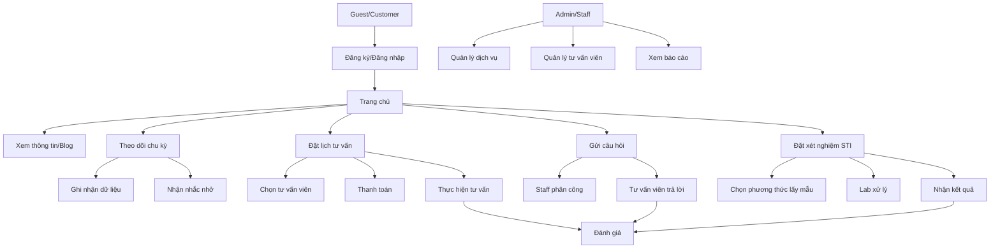

# GENDER HEALTHCARE - CÁC FLOW CƠ BẢN

## TỔNG QUAN

Tài liệu này mô tả các flow cơ bản trong hệ thống Gender Healthcare một cách đơn giản và dễ hiểu.

---

## 1. TRANG CHỦ VÀ THÔNG TIN

### Flow cơ bản:
1. **Guest/Customer** truy cập trang chủ
2. Hệ thống hiển thị:
   - Thông tin cơ sở y tế  
   - Dịch vụ nổi bật
   - Blog chia sẻ kiến thức
   - FAQ
3. **Guest** có thể:
   - Đọc blog về giới tính, sinh sản, STI
   - Xem thông tin dịch vụ
   - Đăng ký tài khoản

### Quản lý nội dung (Admin):
1. **Admin** đăng nhập
2. Quản lý blog: tạo, sửa, xóa
3. Cập nhật thông tin cơ sở y tế
4. Quản lý FAQ

---

## 2. THEO DỖI CHU KỲ KINH NGUYỆT

### Flow cơ bản:
1. **Customer** truy cập trang Cycle Tracking
2. Lần đầu: Nhập thông tin khởi tạo (ngày kinh nguyệt gần nhất, chu kỳ trung bình)
3. Ghi nhận dữ liệu hàng tháng:
   - Ngày bắt đầu/kết thúc kinh nguyệt
   - Mức độ, triệu chứng, tâm trạng
4. Hệ thống tự động:
   - Dự đoán ngày kinh nguyệt tiếp theo
   - Tính thời kỳ rụng trứng
   - Gửi nhắc nhở uống thuốc tránh thai
5. Xem báo cáo thống kê chu kỳ

---

## 3. ĐẶT LỊCH TƯ VẤN TRỰC TUYẾN

### Flow cơ bản:
1. **Customer** chọn dịch vụ tư vấn
2. Chọn tư vấn viên (hoặc hệ thống tự động phân công)
3. Chọn loại tư vấn: online/điện thoại/trực tiếp
4. Chọn ngày giờ phù hợp
5. Điền thông tin:
   - Vấn đề sức khỏe
   - Lịch sử bệnh án
   - Yêu cầu đặc biệt
6. Thanh toán (nếu có phí)
7. Nhận xác nhận và hướng dẫn
8. Tư vấn viên xác nhận lịch hẹn
9. Thực hiện buổi tư vấn
10. Đánh giá dịch vụ sau khi hoàn thành

---

## 4. GỬI CÂU HỎI TƯ VẤN RIÊNG TƯ

### Flow cơ bản:
1. **Customer** truy cập trang đặt câu hỏi
2. Điền form câu hỏi:
   - Chọn danh mục
   - Mô tả chi tiết vấn đề
   - Mức độ khẩn cấp
   - Tùy chọn ẩn danh
3. Gửi câu hỏi
4. **Staff** xem và phân công cho tư vấn viên phù hợp
5. **Tư vấn viên** trả lời câu hỏi chi tiết
6. **Customer** nhận thông báo và xem câu trả lời
7. Đánh giá chất lượng câu trả lời
8. Có thể yêu cầu tư vấn trực tiếp nếu cần

---

## 5. QUẢN LÝ XÉT NGHIỆM STI

### Flow cơ bản:
1. **Customer** chọn gói xét nghiệm STI
2. Chọn phương thức lấy mẫu:
   - Đến phòng khám
   - Kit tại nhà
   - Dịch vụ lấy mẫu tận nơi
3. Đặt lịch và điền thông tin sức khỏe
4. Thanh toán
5. **Staff** xác nhận và chuẩn bị:
   - Lên lịch lấy mẫu
   - Gửi kit về nhà (nếu chọn)
   - Phân công nhân viên lấy mẫu
6. Lấy mẫu theo lịch hẹn
7. **Lab** xử lý mẫu và ra kết quả
8. **Customer** nhận thông báo kết quả
9. Xem kết quả online:
   - Kết quả bình thường: xem trực tiếp
   - Kết quả bất thường: bắt buộc tư vấn với bác sĩ
10. Tư vấn follow-up nếu cần
11. Đánh giá dịch vụ

---

## 6. QUẢN LÝ DỊCH VỤ (Admin/Staff)

### Flow cơ bản:
1. **Admin/Manager** quản lý catalog dịch vụ:
   - Tạo/sửa/xóa dịch vụ
   - Thiết lập giá cả
   - Quản lý gói dịch vụ
2. Cấu hình quy trình xét nghiệm:
   - Yêu cầu chuẩn bị
   - Hướng dẫn lấy mẫu
   - Thời gian có kết quả
3. Quản lý khuyến mãi và ưu đãi

---

## 7. QUẢN LÝ TƯ VẤN VIÊN

### Flow cơ bản:
1. **Admin** thêm tư vấn viên mới:
   - Thông tin cá nhân
   - Bằng cấp và chứng chỉ
   - Chuyên môn
2. **Tư vấn viên** tự quản lý:
   - Cập nhật thông tin cá nhân
   - Thiết lập lịch làm việc
   - Xem lịch hẹn
3. **Staff** phân công công việc:
   - Gán câu hỏi cho tư vấn viên
   - Theo dõi hiệu suất
4. **Manager** đánh giá hiệu quả làm việc

---

## 8. ĐÁNH GIÁ VÀ PHẢN HỒI

### Flow cơ bản:
1. Sau mỗi dịch vụ, **Customer** nhận yêu cầu đánh giá
2. Đánh giá theo các tiêu chí:
   - Chất lượng dịch vụ (1-5 sao)
   - Thái độ nhân viên
   - Tốc độ xử lý
   - Phản hồi chi tiết (tùy chọn)
3. Hệ thống tự động cập nhật:
   - Rating trung bình của tư vấn viên
   - Rating dịch vụ
4. **Manager** xem báo cáo feedback để cải thiện

---

## 9. QUẢN LÝ HỒ SƠ NGƯỜI DÙNG

### Flow cơ bản:
1. **Customer** tạo và quản lý hồ sơ:
   - Thông tin cá nhân
   - Lịch sử bệnh án
   - Hồ sơ gia đình
2. Xem lịch sử dịch vụ:
   - Lịch sử tư vấn
   - Kết quả xét nghiệm
   - Lịch sử thanh toán
3. **Staff** xem thông tin cần thiết cho dịch vụ
4. **Admin** quản lý quyền truy cập dữ liệu

---

## 10. DASHBOARD VÀ BÁO CÁO

### Flow cơ bản:
1. **Manager/Admin** truy cập dashboard
2. Xem các chỉ số chính:
   - Số lượng người dùng
   - Doanh thu theo thời gian
   - Số lượng dịch vụ được sử dụng
   - Rating trung bình
3. Tạo báo cáo chi tiết:
   - Báo cáo doanh thu
   - Hiệu suất tư vấn viên
   - Thống kê dịch vụ phổ biến
   - Phân tích xu hướng
4. Xuất báo cáo PDF/Excel

---

## SƠ ĐỒ TỔNG QUAN

---

## LƯU Ý QUAN TRỌNG

### Bảo mật:
- Tất cả dữ liệu sức khỏe được mã hóa
- Phân quyền truy cập nghiêm ngặt
- Tuân thủ quy định bảo mật y tế

### Hiệu suất:
- Phản hồi nhanh trong vòng 24h cho câu hỏi khẩn cấp
- Kết quả xét nghiệm trong 2-3 ngày
- Hệ thống backup tự động

### Trải nghiệm người dùng:
- Giao diện đơn giản, dễ sử dụng
- Thông báo kịp thời qua email/SMS
- Hỗ trợ đa thiết bị (web, mobile) 