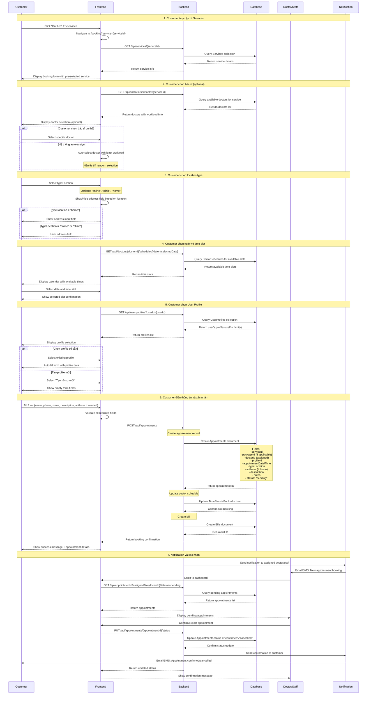
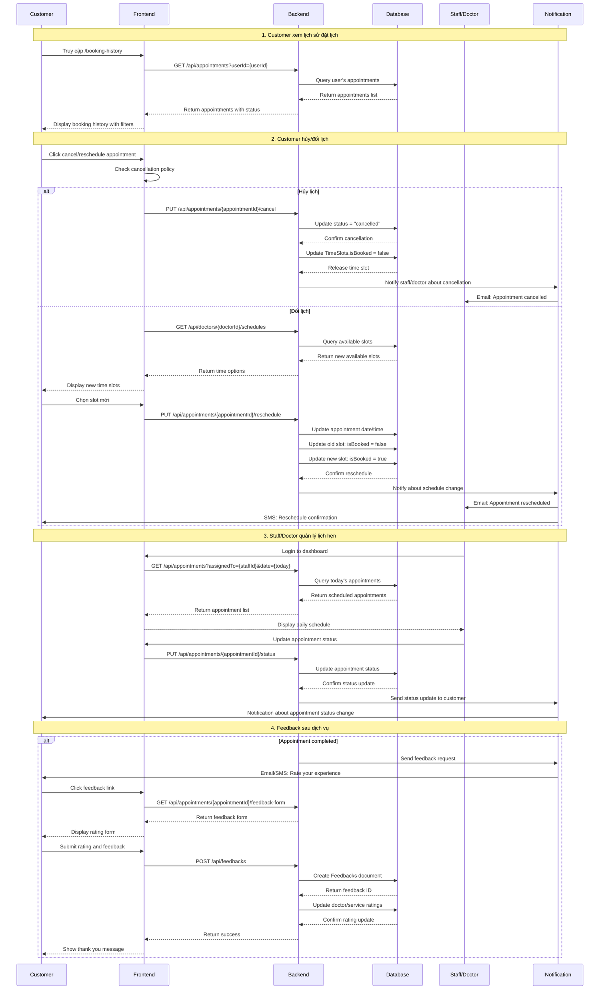
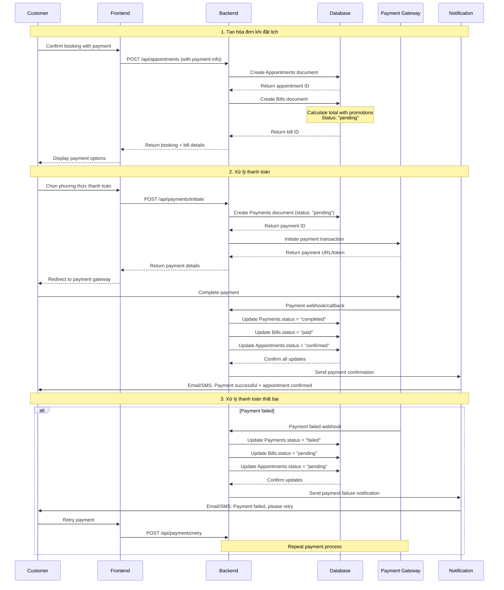

# Sequence Diagrams - Unified Booking Flow

## Tổng quan

Tài liệu này mô tả sequence diagram cho **luồng đặt lịch hẹn thống nhất** trong hệ thống Gender Healthcare.

**Tất cả các dịch vụ đều sử dụng một luồng booking duy nhất tại `/booking`:**

- Consultation (Tư vấn)
- STI Testing (Xét nghiệm STI)
- Health Checkup (Khám sức khỏe)
- Home Sampling (Lấy mẫu tại nhà)
- Cycle Tracking (Theo dõi chu kỳ)

## 1. Luồng Đặt lịch Thống nhất (Unified Booking Flow)



## 2. Luồng Quản lý Lịch hẹn (Appointment Management)



## 3. Luồng Thanh toán (Payment Flow)



## 4. Entities và Relationships

### Các Entity chính trong Booking Flow:

- **Users**: Customer, Doctor, Staff thực hiện booking
- **UserProfiles**: Hồ sơ của customer (có thể đặt cho gia đình)
- **Services**: Các dịch vụ có thể đặt lịch
- **ServicePackages**: Gói dịch vụ combo
- **Doctors**: Bác sĩ thực hiện tư vấn/khám
- **DoctorSchedules**: Lịch làm việc của bác sĩ
- **Appointments**: Lịch hẹn chính
- **AppointmentTests**: Chi tiết xét nghiệm
- **Bills**: Hóa đơn thanh toán
- **Payments**: Giao dịch thanh toán
- **Feedbacks**: Đánh giá sau dịch vụ

### Luồng dữ liệu chính:

1. **Service Selection** → **Doctor/Schedule Selection** → **Profile Selection** → **Appointment Creation**
2. **Appointment** → **Bill Creation** → **Payment Processing**
3. **Appointment Execution** → **Result/Record Creation** → **Feedback Collection**

### Package Handling:

- **ServicePackages**: Gói dịch vụ combo (VD: Gói STI cơ bản, Gói khám tổng quát)
- Trong booking form, nếu service có packages thì hiển thị package selection
- Package được lưu trong `Appointments.packageId`
- Pricing được tính dựa trên package + location type
- Một appointment có thể có `serviceId` (single service) HOẶC `packageId` (service package)

## 5. Trạng thái Appointment

```
pending → confirmed → in_progress → completed
    ↓         ↓           ↓
cancelled  cancelled   cancelled
```

### Mô tả trạng thái:

- **pending**: Vừa tạo, chờ xác nhận từ staff/doctor
- **confirmed**: Đã xác nhận, chờ thực hiện
- **in_progress**: Đang thực hiện dịch vụ
- **completed**: Hoàn thành dịch vụ
- **cancelled**: Đã hủy (có thể hủy ở bất kỳ trạng thái nào trước completed)

## 6. Business Rules

### Booking Rules:

1. **Unified Flow**: Tất cả services đều qua `/booking` với query parameter `?service={serviceId}`
2. **Doctor Assignment**: Customer có thể chọn doctor hoặc để hệ thống auto-assign (doctor ít workload nhất)
3. **Location Logic**: Address field chỉ hiện khi `typeLocation = "home"`
4. **Profile Selection**: Customer chọn profile (bản thân hoặc người thân) trước khi điền form
5. **Time Slot**: Mỗi slot chỉ có thể book bởi 1 appointment
6. **Package vs Service**: Appointment có thể có `serviceId` HOẶC `packageId`, không được cả hai
7. **Cancellation**: Có thể hủy trước 24h (tùy policy)
8. **Payment**: Phải hoàn thành để confirm appointment

### Notification Rules:

1. Gửi confirmation email/SMS sau khi đặt lịch
2. Reminder 24h trước appointment
3. Notification khi có thay đổi status
4. Feedback request sau khi completed

### Access Control:

- **Customer**: Chỉ xem/quản lý appointment của mình
- **Doctor**: Xem appointment được assign + update status
- **Staff**: Quản lý tất cả appointment + upload results
- **Manager/Admin**: Full access + reports

## 7. API Endpoints Required

### Booking Flow APIs:

```
GET /api/services/{serviceId}                    # Get service details
GET /api/services/{serviceId}/packages           # Get service packages (if any)
GET /api/doctors?serviceId={serviceId}           # Get doctors for service
GET /api/doctors/{doctorId}/schedules            # Get doctor's available slots
GET /api/user-profiles?userId={userId}          # Get user's profiles
POST /api/user-profiles                          # Create new profile
POST /api/appointments                           # Create appointment
PUT /api/appointments/{id}/status                # Update appointment status
GET /api/appointments?userId={userId}           # Get user's appointments
PUT /api/appointments/{id}/cancel                # Cancel appointment
PUT /api/appointments/{id}/reschedule            # Reschedule appointment
```

### Supporting APIs:

```
POST /api/bills                                 # Create bill
POST /api/payments/initiate                     # Start payment
POST /api/payments/retry                        # Retry failed payment
POST /api/feedbacks                             # Submit feedback
GET /api/appointments/{id}/results               # Get test results
POST /api/medical-records                       # Create medical record
```
