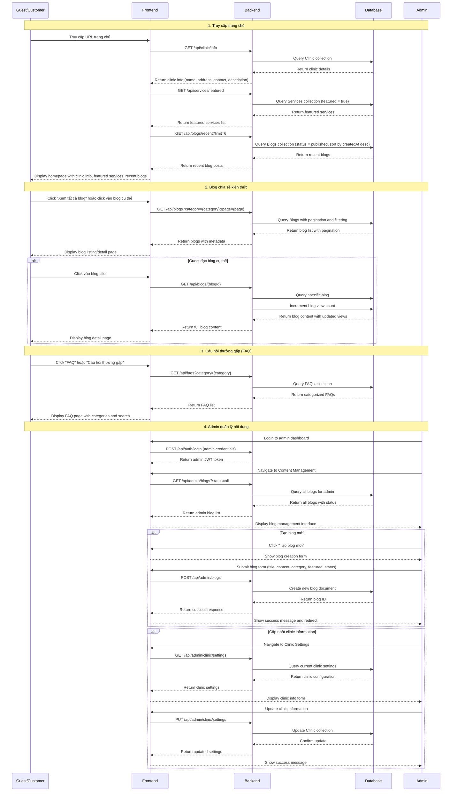
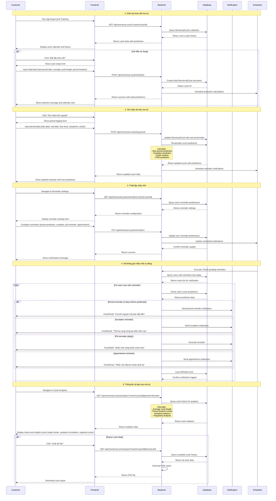

# GENDER HEALTHCARE - CÁC FLOW CHI TIẾT HỆ THỐNG

## TỔNG QUAN

Tài liệu này mô tả đầy đủ các flow/luồng hoạt động trong hệ thống Gender Healthcare, bao gồm:

1. **Homepage & Information Flow** - Trang chủ và luồng thông tin
2. **Menstrual Cycle Tracking Flow** - Theo dõi chu kỳ kinh nguyệt  
3. **Online Consultation Booking Flow** - Đặt lịch tư vấn trực tuyến
4. **Private Q&A Consultation Flow** - Tư vấn câu hỏi riêng tư
5. **STI Testing Management Flow** - Quản lý xét nghiệm STI
6. **Service Management Flow** - Quản lý dịch vụ
7. **Consultant Management Flow** - Quản lý tư vấn viên
8. **Rating & Feedback Flow** - Đánh giá và phản hồi
9. **User Profile Management Flow** - Quản lý hồ sơ người dùng
10. **Dashboard & Reporting Flow** - Báo cáo và thống kê

---

## 1. HOMEPAGE & INFORMATION FLOW

### 1.1 Trang chủ giới thiệu cơ sở y tế và dịch vụ

---

## 2. MENSTRUAL CYCLE TRACKING FLOW

### 2.1 Theo dõi chu kỳ kinh nguyệt và nhắc nhở

---

## 3. ONLINE CONSULTATION BOOKING FLOW

### 3.1 Đặt lịch tư vấn trực tuyến với chuyên gia

```mermaid
sequenceDiagram
    participant C as Customer
    participant F as Frontend
    participant B as Backend
    participant DB as Database
    participant D as Doctor/Consultant
    participant N as Notification
    participant P as Payment

    Note over C,P: 1. Khám phá và chọn dịch vụ tư vấn
    C->>F: Navigate to /services hoặc /consultations
    F->>B: GET /api/services?type=consultation
    B->>DB: Query Services collection (type = consultation)
    DB-->>B: Return consultation services
    B-->>F: Return consultation service list
    F-->>C: Display consultation services with descriptions and pricing

    C->>F: Click "Đặt lịch tư vấn" for specific service
    F->>F: Navigate to /booking?serviceId={consultationServiceId}
    F->>B: GET /api/services/{serviceId}
    B->>DB: Query specific consultation service
    DB-->>B: Return service details
    B-->>F: Return service information
    F-->>C: Display booking form with pre-selected consultation service

    Note over C,P: 2. Chọn tư vấn viên (nếu có)
    F->>B: GET /api/consultants?serviceId={serviceId}&available=true
    B->>DB: Query Consultants for specific service
    Note over DB: Filter by:<br/>- Service expertise<br/>- Active status<br/>- Current workload
    DB-->>B: Return available consultants with ratings and specializations
    B-->>F: Return consultant list with availability
    F-->>C: Display consultant selection with profiles, ratings, specializations

    alt Customer chọn consultant cụ thể
        C->>F: Select specific consultant
        F->>F: Set selectedConsultantId
    else Hệ thống auto-assign
        F->>F: Auto-select consultant với workload thấp nhất
        Note over F: Logic: Least busy consultant<br/>with highest rating
    end

    Note over C,P: 3. Chọn loại tư vấn và thời gian
    C->>F: Select consultation type (online video, phone call, in-person)
    F->>F: Update form based on consultation type
    
    alt Online consultation
        F-->>C: Show online consultation terms and requirements
    else In-person consultation
        F-->>C: Show clinic address and preparation instructions
    end

    F->>B: GET /api/consultants/{consultantId}/availability?date={selectedDate}
    B->>DB: Query ConsultantSchedules for available time slots
    DB-->>B: Return available slots for selected date
    B-->>F: Return time slot options
    F-->>C: Display available time slots in calendar format

    C->>F: Select preferred date and time slot
    F-->>C: Show selected appointment details confirmation

    Note over C,P: 4. Điền thông tin tư vấn
    F->>B: GET /api/user-profiles?userId={userId}
    B->>DB: Query UserProfiles for current user
    DB-->>B: Return user's health profiles
    B-->>F: Return profile options
    F-->>C: Display profile selection (self, family member, new profile)

    C->>F: Select profile or create new
    F-->>C: Show health questionnaire form
    C->>F: Fill consultation form:
    Note over C: Required fields:<br/>- Health concerns/symptoms<br/>- Medical history relevant to concern<br/>- Current medications<br/>- Preferred communication method<br/>- Special requirements
    
    F->>F: Validate form data
    F->>B: POST /api/consultations/book
    
    B->>DB: Create Consultation document
    Note over DB: Fields:<br/>- serviceId, consultantId<br/>- customerId, profileId<br/>- appointmentDateTime<br/>- consultationType<br/>- healthConcerns, medicalHistory<br/>- status: "pending"<br/>- communicationPreference
    DB-->>B: Return consultation ID

    B->>DB: Create Bill for consultation
    DB-->>B: Return bill ID
    
    B->>DB: Update ConsultantSchedule (mark slot as booked)
    DB-->>B: Confirm schedule update

    B-->>F: Return booking confirmation with consultation and bill details
    F-->>C: Show booking success page with consultation details

    Note over C,P: 5. Thanh toán (nếu có phí)
    alt Paid consultation service
        F-->>C: Display payment options
        C->>F: Select payment method
        F->>P: Initialize payment process
        P->>B: Process payment
        B->>DB: Update Bill status to "paid"
        B->>DB: Update Consultation status to "confirmed"
        DB-->>B: Confirm payment completion
        P-->>F: Return payment success
        F-->>C: Show payment confirmation
    else Free consultation
        B->>DB: Update Consultation status to "confirmed"
        DB-->>B: Confirm status update
    end

    Note over C,P: 6. Thông báo và xác nhận
    B->>N: Send notifications
    N->>D: Email/SMS to consultant: New consultation booking
    N->>C: Email/SMS to customer: Booking confirmation with details
    
    alt Consultant confirms availability
        D->>F: Login to consultant dashboard
        F->>B: GET /api/consultations?consultantId={consultantId}&status=pending
        B->>DB: Query pending consultations
        DB-->>B: Return consultation list
        B-->>F: Return consultations
        F-->>D: Display pending consultation requests
        
        D->>F: Confirm consultation
        F->>B: PUT /api/consultations/{consultationId}/confirm
        B->>DB: Update Consultation status to "confirmed"
        DB-->>B: Confirm status update
        B->>N: Send confirmation to customer
        N->>C: Email/SMS: Consultation confirmed by doctor
    end

    Note over C,P: 7. Chuẩn bị và thực hiện tư vấn
    alt 24 hours before consultation
        B->>N: Send reminder notifications
        N->>C: Email/SMS: Reminder về consultation tomorrow
        N->>D: Email: Reminder về consultation schedule
    end
    
    alt Online consultation
        B->>N: Send consultation link
        N->>C: Email: Video call link và instructions
        N->>D: Email: Video call link và patient information
    end
    
    alt Day of consultation
        B->>N: Send day-of reminders
        N->>C: Push notification: Consultation starting in 30 minutes
        N->>D: Push notification: Upcoming consultation
        
        D->>F: Start consultation session
        F->>B: PUT /api/consultations/{consultationId}/start
        B->>DB: Update status to "in-progress", log start time
        DB-->>B: Confirm session start
        
        Note over D: Conduct consultation<br/>via video/phone/in-person
        
        D->>F: End consultation and add notes
        F->>B: PUT /api/consultations/{consultationId}/complete
        B->>DB: Update status to "completed", add consultation notes, log end time
        DB-->>B: Confirm completion
    end

    Note over C,P: 8. Theo dõi sau tư vấn
    B->>N: Send follow-up request
    N->>C: Email: Đánh giá dịch vụ tư vấn
    
    C->>F: Click feedback link
    F->>B: GET /api/consultations/{consultationId}/feedback-form
    B-->>F: Return feedback form
    F-->>C: Display rating and feedback form
    
    C->>F: Submit rating (1-5 stars) and written feedback
    F->>B: POST /api/feedback
    B->>DB: Create Feedback document
    B->>DB: Update Consultant average rating
    DB-->>B: Confirm feedback saved
    B-->>F: Return success
    F-->>C: Show thank you message

    alt Follow-up consultation needed
        D->>F: Recommend follow-up appointment
        F->>B: POST /api/consultations/{consultationId}/recommend-followup
        B->>N: Send follow-up recommendation to customer
        N->>C: Email: Doctor recommends follow-up consultation
        
        C->>F: Book follow-up consultation (streamlined process)
        Note over C,F: Simplified booking với<br/>same consultant, related concern
    end
```

---

## 4. PRIVATE Q&A CONSULTATION FLOW

### 4.1 Gửi câu hỏi để được tư vấn riêng

```mermaid
sequenceDiagram
    participant C as Customer
    participant F as Frontend
    participant B as Backend
    participant DB as Database
    participant S as Staff
    participant D as Consultant
    participant N as Notification

    Note over C,N: 1. Customer gửi câu hỏi riêng tư
    C->>F: Navigate to /ask-question hoặc /private-consultation
    F->>B: GET /api/question-categories
    B->>DB: Query QuestionCategories collection
    DB-->>B: Return available categories
    B-->>F: Return category list
    F-->>C: Display question submission form with categories

    C->>F: Fill question form:
    Note over C: Fields:<br/>- Category selection<br/>- Question title<br/>- Detailed description<br/>- Age, gender (optional)<br/>- Medical history (relevant)<br/>- Urgency level<br/>- Preferred response method<br/>- Anonymous option
    
    F->>F: Validate form data (check for sensitive content, completeness)
    F->>B: POST /api/questions/private
    
    B->>DB: Create Question document
    Note over DB: Fields:<br/>- customerId<br/>- category, title, description<br/>- urgencyLevel<br/>- status: "pending"<br/>- isAnonymous<br/>- preferredResponseMethod<br/>- submittedAt: current timestamp
    DB-->>B: Return question ID
    
    B->>DB: Create QuestionAssignment (for tracking)
    DB-->>B: Return assignment ID
    
    B-->>F: Return submission confirmation
    F-->>C: Show success message với question tracking number

    Note over C,N: 2. Staff triaging và assignment
    S->>F: Login to staff dashboard
    F->>B: GET /api/admin/questions?status=pending&sort=urgency
    B->>DB: Query pending questions sorted by urgency
    DB-->>B: Return questions list với priority order
    B-->>F: Return prioritized questions
    F-->>S: Display question queue với triage information

    S->>F: Review question details
    F->>B: GET /api/admin/questions/{questionId}/details
    B->>DB: Query full question details
    DB-->>B: Return complete question information
    B-->>F: Return question details
    F-->>S: Display full question with suggested consultants

    S->>F: Assign question to appropriate consultant
    F->>B: PUT /api/admin/questions/{questionId}/assign
    Note over B: Payload: {<br/>  consultantId: selected_consultant,<br/>  priority: urgent/normal/low,<br/>  estimatedResponseTime: hours<br/>}
    
    B->>DB: Update QuestionAssignment
    B->>DB: Update Question status to "assigned"
    DB-->>B: Confirm assignment
    
    B->>N: Notify assigned consultant
    N->>D: Email/SMS: New question assignment with details
    B->>N: Notify customer about assignment
    N->>C: SMS: Câu hỏi đã được gửi tới chuyên gia, dự kiến phản hồi trong {estimatedTime}
    
    B-->>F: Return assignment confirmation
    F-->>S: Show assignment success message

    Note over C,N: 3. Consultant trả lời câu hỏi
    D->>F: Login to consultant dashboard
    F->>B: GET /api/consultant/questions?consultantId={consultantId}&status=assigned
    B->>DB: Query assigned questions for consultant
    DB-->>B: Return question list với deadlines
    B-->>F: Return consultant's question queue
    F-->>D: Display assigned questions with priority và deadline

    D->>F: Select question to answer
    F->>B: GET /api/consultant/questions/{questionId}/details
    B->>DB: Query question with customer health profile (if permission granted)
    DB-->>B: Return question details và relevant customer info
    B-->>F: Return complete question context
    F-->>D: Display question details và customer context

    D->>F: Compose detailed answer
    F-->>D: Show answer composition form with:
    Note over D: Fields:<br/>- Medical advice/guidance<br/>- Recommended actions<br/>- Warning signs to watch for<br/>- Follow-up recommendations<br/>- Resource links<br/>- Disclaimer text
    
    D->>F: Submit answer
    F->>B: POST /api/consultant/questions/{questionId}/answer
    
    B->>DB: Create QuestionAnswer document
    Note over DB: Fields:<br/>- questionId, consultantId<br/>- answerText, recommendations<br/>- medicalDisclaimer<br/>- resourceLinks<br/>- isFollowupNeeded<br/>- answeredAt: current timestamp
    DB-->>B: Return answer ID
    
    B->>DB: Update Question status to "answered"
    B->>DB: Update QuestionAssignment với completion time
    DB-->>B: Confirm answer submission
    
    B-->>F: Return answer confirmation
    F-->>D: Show answer submitted successfully

    Note over C,N: 4. Customer nhận phản hồi
    B->>N: Send answer notification to customer
    
    alt Email preferred
        N->>C: Email: Câu hỏi đã được trả lời, click để xem
    else SMS preferred  
        N->>C: SMS: Chuyên gia đã trả lời câu hỏi, đăng nhập để xem
    else In-app notification
        N->>C: Push notification: Bạn có câu trả lời mới
    end

    C->>F: Click notification hoặc login to check answers
    F->>B: GET /api/questions/my-questions?userId={userId}
    B->>DB: Query user's questions với answers
    DB-->>B: Return questions với answer status
    B-->>F: Return user's Q&A history
    F-->>C: Display Q&A history list

    C->>F: Click vào answered question
    F->>B: GET /api/questions/{questionId}/answer
    B->>DB: Query question và associated answer
    DB-->>B: Return question-answer pair
    B-->>F: Return complete Q&A
    F-->>C: Display question và detailed medical answer

    Note over C,N: 5. Follow-up và feedback
    alt Customer muốn follow-up
        C->>F: Click "Đặt câu hỏi thêm" hoặc "Cần tư vấn trực tiếp"
        F->>B: POST /api/questions/{questionId}/followup-request
        B->>DB: Create follow-up request
        B->>N: Notify original consultant
        N->>D: Email: Customer cần follow-up cho câu hỏi #{questionId}
        
        alt Consultant recommends direct consultation
            D->>F: Recommend consultation appointment
            F->>B: POST /api/questions/{questionId}/recommend-consultation
            B->>N: Send consultation recommendation
            N->>C: Email: Chuyên gia khuyên bạn nên đặt lịch tư vấn trực tiếp
        end
    end
    
    C->>F: Rate answer quality (helpful/not helpful)
    F->>B: POST /api/questions/{questionId}/feedback
    B->>DB: Create AnswerFeedback document
    B->>DB: Update consultant rating based on feedback
    DB-->>B: Confirm feedback submission
    B-->>F: Return feedback confirmation
    F-->>C: Show thank you message

    Note over C,N: 6. Administrative tracking và quality control
    S->>F: Monitor Q&A performance
    F->>B: GET /api/admin/qa-analytics?period=week
    B->>DB: Aggregate Q&A metrics:
    Note over DB: Metrics:<br/>- Response time averages<br/>- Question categories distribution<br/>- Consultant performance<br/>- Customer satisfaction<br/>- Volume trends
    DB-->>B: Return analytics data
    B-->>F: Return Q&A performance report
    F-->>S: Display Q&A dashboard với KPIs

    alt Quality review needed
        S->>F: Flag answers for quality review
        F->>B: PUT /api/admin/questions/{questionId}/flag-review
        B->>DB: Mark answer for quality review
        B->>N: Notify senior consultant hoặc medical director
        N->>D: Email: Answer review requested for medical accuracy
    end
```

---

## 5. STI TESTING MANAGEMENT FLOW

### 5.1 Quản lý toàn diện quy trình xét nghiệm STI

```mermaid
sequenceDiagram
    participant C as Customer
    participant F as Frontend
    participant B as Backend
    participant DB as Database
    participant S as Staff
    participant L as Lab
    participant N as Notification
    participant P as Payment

    Note over C,P: 1. Customer đặt lịch xét nghiệm STI
    C->>F: Navigate to /sti-testing hoặc click từ services
    F->>B: GET /api/services?type=sti-testing
    B->>DB: Query STI testing services và packages
    DB-->>B: Return available STI tests (individual tests, combo packages)
    B-->>F: Return STI testing options với pricing
    F-->>C: Display STI testing services:
    Note over C: Options:<br/>- Individual tests (HIV, Syphilis, Gonorrhea, etc.)<br/>- Combo packages (Basic STI Panel, Comprehensive Panel)<br/>- Home sampling kits<br/>- In-clinic testing

    C->>F: Select STI test package hoặc individual tests
    F->>F: Navigate to /booking?serviceType=sti-testing&serviceId={testId}
    
    F->>B: GET /api/sti-tests/{testId}/requirements
    B->>DB: Query test preparation requirements và instructions
    DB-->>B: Return test requirements (fasting, timing, preparation)
    B-->>F: Return preparation instructions
    F-->>C: Display test information và preparation requirements

    Note over C,P: 2. Chọn phương thức lấy mẫu
    C->>F: Select testing method:
    Note over C: Options:<br/>- In-clinic visit<br/>- Home sampling kit<br/>- Mobile lab service
    
    alt In-clinic testing
        F->>B: GET /api/lab/schedules?testType={testType}
        B->>DB: Query available lab appointment slots
        DB-->>B: Return available times at clinic
        B-->>F: Return scheduling options
        F-->>C: Display available appointment times
        
        C->>F: Select preferred date và time slot
        
    else Home sampling kit
        F-->>C: Show home kit delivery options và instructions
        C->>F: Confirm delivery address và preferred delivery time
        
    else Mobile lab service
        F-->>C: Show mobile service areas và scheduling
        C->>F: Select location và time for mobile visit
    end

    Note over C,P: 3. Điền thông tin và xác nhận đặt lịch
    F->>B: GET /api/user-profiles?userId={userId}
    B->>DB: Query user health profiles
    DB-->>B: Return profile options
    B-->>F: Return available profiles
    F-->>C: Display profile selection

    C->>F: Select profile và fill additional information:
    Note over C: Required info:<br/>- Medical history relevant to STI testing<br/>- Current symptoms (if any)<br/>- Risk factors<br/>- Previous STI testing history<br/>- Emergency contact<br/>- Insurance information (if applicable)
    
    F->>F: Validate form data và test eligibility
    F->>B: POST /api/sti-tests/book
    
    B->>DB: Create STITestOrder document
    Note over DB: Fields:<br/>- customerId, profileId<br/>- testType, testPackageId<br/>- samplingMethod<br/>- appointmentDateTime<br/>- deliveryAddress (if home kit)<br/>- preparationInstructions<br/>- status: "pending"<br/>- emergencyContact
    DB-->>B: Return test order ID
    
    B->>DB: Create Bill for testing service
    DB-->>B: Return bill ID
    
    B-->>F: Return booking confirmation
    F-->>C: Show booking success với order details và preparation instructions

    Note over C,P: 4. Thanh toán và xác nhận
    F-->>C: Display payment options
    C->>F: Select payment method
    F->>P: Process payment
    P->>B: Confirm payment
    B->>DB: Update Bill status to "paid"
    B->>DB: Update STITestOrder status to "confirmed"
    DB-->>B: Confirm payment và order confirmation
    P-->>F: Return payment success
    F-->>C: Show payment confirmation và next steps

    Note over C,P: 5. Staff xử lý đơn hàng và chuẩn bị
    B->>N: Send notifications
    N->>S: Email: New STI test order #{orderId} cần xử lý
    N->>C: SMS: STI test đã được xác nhận, chuẩn bị theo hướng dẫn
    
    S->>F: Login to staff dashboard
    F->>B: GET /api/admin/sti-tests?status=confirmed&date=today
    B->>DB: Query confirmed STI test orders
    DB-->>B: Return orders cần xử lý hôm nay
    B-->>F: Return order list
    F-->>S: Display daily STI test schedule

    alt In-clinic appointment
        S->>F: Prepare for patient visit
        F->>B: PUT /api/sti-tests/{orderId}/prepare
        B->>DB: Update status to "preparation"
        B->>DB: Prepare lab requisition và patient instructions
        DB-->>B: Confirm preparation
        
    else Home sampling kit
        S->>F: Process home kit shipment
        F->>B: PUT /api/sti-tests/{orderId}/ship-kit
        B->>DB: Update status to "kit_shipped"
        B->>DB: Log shipment tracking information
        DB-->>B: Confirm shipment
        B->>N: Send shipping notification
        N->>C: Email: STI testing kit đã được gửi, tracking: {trackingNumber}
        
    else Mobile lab service
        S->>F: Schedule mobile lab technician
        F->>B: PUT /api/sti-tests/{orderId}/schedule-mobile
        B->>DB: Update status to "mobile_scheduled"
        B->>DB: Assign mobile technician
        DB-->>B: Confirm mobile scheduling
        B->>N: Send technician assignment notification
        N->>C: SMS: Mobile lab technician sẽ đến vào {appointmentTime}
    end

    Note over C,P: 6. Lấy mẫu xét nghiệm
    alt In-clinic visit
        C->>F: Check-in for appointment
        S->>F: Confirm patient arrival
        F->>B: PUT /api/sti-tests/{orderId}/checkin
        B->>DB: Update status to "sample_collection"
        DB-->>B: Confirm check-in
        
        Note over S,L: Collect samples at clinic
        S->>F: Complete sample collection
        F->>B: PUT /api/sti-tests/{orderId}/sample-collected
        B->>DB: Update status, log collection time và sample IDs
        DB-->>B: Confirm sample collection
        
    else Home sampling (customer self-collect)
        C->>F: Receive home kit và follow instructions
        C->>F: Complete sample collection và schedule pickup
        F->>B: PUT /api/sti-tests/{orderId}/self-collected
        B->>DB: Update status to "sample_collected_home"
        B->>N: Schedule sample pickup
        N->>L: Email: Home sample ready for pickup at {address}
        
    else Mobile lab service
        L->>C: Mobile technician arrives at location
        Note over L,C: Technician collects samples on-site
        L->>F: Confirm mobile sample collection
        F->>B: PUT /api/sti-tests/{orderId}/mobile-collected
        B->>DB: Update status và log collection details
        DB-->>B: Confirm mobile collection
    end

    Note over C,P: 7. Xử lý mẫu tại Lab
    L->>F: Receive samples for processing
    F->>B: PUT /api/sti-tests/{orderId}/lab-received
    B->>DB: Update status to "lab_processing"
    B->>DB: Log lab receipt time và batch number
    DB-->>B: Confirm lab processing start
    
    B->>N: Send processing notification
    N->>C: SMS: Mẫu xét nghiệm đã nhận tại lab, kết quả sẽ có trong 2-3 ngày

    Note over L: Lab performs testing<br/>Quality control<br/>Result verification
    
    L->>F: Enter test results
    F->>B: POST /api/sti-tests/{orderId}/results
    B->>DB: Create STITestResults document
    Note over DB: Fields:<br/>- testOrderId<br/>- testResults (per test type)<br/>- referenceRanges<br/>- abnormalFlags<br/>- labComments<br/>- resultDate<br/>- verifiedBy (lab technician)
    DB-->>B: Return result ID
    
    B->>DB: Update STITestOrder status to "results_ready"
    DB-->>B: Confirm result entry
    
    alt Abnormal results found
        B->>N: Send urgent notification to medical staff
        N->>S: Email: URGENT - Abnormal STI test results require medical review
        
        S->>F: Review abnormal results
        F->>B: PUT /api/sti-tests/{orderId}/medical-review
        B->>DB: Flag for medical consultation
        DB-->>B: Confirm medical review flag
    end

    Note over C,P: 8. Trả kết quả cho Customer
    B->>N: Send result notification
    N->>C: Email: Kết quả xét nghiệm STI đã sẵn sàng, đăng nhập để xem
    
    alt Normal results
        C->>F: Login và navigate to test results
        F->>B: GET /api/sti-tests/my-results?userId={userId}
        B->>DB: Query user's test results
        DB-->>B: Return available results
        B-->>F: Return results list
        F-->>C: Display test results list
        
        C->>F: Click to view specific result
        F->>B: GET /api/sti-tests/{orderId}/detailed-results
        B->>DB: Query detailed test results
        DB-->>B: Return complete results với interpretation
        B-->>F: Return result details
        F-->>C: Display detailed results với medical interpretation
        
    else Abnormal results (require consultation)
        B->>N: Send priority notification
        N->>C: Phone call + SMS: Kết quả xét nghiệm cần được tư vấn, vui lòng đặt lịch hẹn
        
        C->>F: Click "Đặt lịch tư vấn kết quả"
        F->>F: Navigate to consultation booking với priority flag
        Note over F: Pre-fill consultation reason:<br/>"STI test result consultation"
    end

    Note over C,P: 9. Follow-up và counseling
    alt Positive STI results
        B->>N: Trigger counseling protocol
        N->>S: Email: Patient #{customerId} cần STI counseling và treatment guidance
        
        S->>F: Schedule counseling session
        F->>B: POST /api/consultations/sti-counseling
        B->>DB: Create priority consultation appointment
        DB-->>B: Return consultation ID
        
        B->>N: Send counseling appointment notification
        N->>C: SMS: Đã đặt lịch tư vấn kết quả STI vào {appointmentTime}
        
        Note over S,C: Conduct counseling session:<br/>- Explain results<br/>- Treatment options<br/>- Partner notification<br/>- Prevention education<br/>- Follow-up testing schedule
        
    else Negative results with risk factors
        B->>N: Send prevention education
        N->>C: Email: Kết quả âm tính, đọc hướng dẫn phòng ngừa và lịch xét nghiệm định kỳ
    end

    Note over C,P: 10. Rating và feedback
    B->>N: Send feedback request (after result delivery)
    N->>C: Email: Đánh giá trải nghiệm xét nghiệm STI
    
    C->>F: Click feedback link
    F->>B: GET /api/sti-tests/{orderId}/feedback-form
    B-->>F: Return feedback form
    F-->>C: Display rating form covering:
    Note over C: Feedback areas:<br/>- Booking process<br/>- Sample collection experience<br/>- Result delivery timeliness<br/>- Result clarity<br/>- Staff professionalism<br/>- Overall satisfaction
    
    C->>F: Submit feedback and rating
    F->>B: POST /api/sti-tests/{orderId}/feedback
    B->>DB: Create STITestFeedback document
    B->>DB: Update service ratings
    DB-->>B: Confirm feedback submission
    B-->>F: Return feedback confirmation
    F-->>C: Show thank you message với health tips

    Note over C,P: 11. Administrative tracking và quality assurance
    S->>F: Monitor STI testing performance
    F->>B: GET /api/admin/sti-analytics?period=month
    B->>DB: Aggregate STI testing metrics:
    Note over DB: KPIs:<br/>- Test volume by type<br/>- Turnaround times<br/>- Positive rate trends<br/>- Customer satisfaction<br/>- Revenue analysis<br/>- Quality control metrics
    DB-->>B: Return STI testing analytics
    B-->>F: Return performance dashboard
    F-->>S: Display STI testing KPIs và trends
```

---

*[Tiếp tục với các flow còn lại...]* 