# IV.3.2. Component Diagram

## Gender Healthcare Service Management System Overview

Component diagram mô tả cấu trúc các thành phần phần mềm và mối quan hệ giữa chúng trong hệ thống Gender Healthcare Service Management. Diagram này thể hiện các components chính và interfaces để hiểu rõ kiến trúc hệ thống.

## Component Diagram

```plantuml
@startuml

package "Client Tier" {
  component [ReactApp] as ReactApp
  ReactApp -() UIInterface : provides
  ReactApp --( APIClient : requires
}

package "Web Tier" {
  component [ExpressServer] as ExpressServer
  component [SecurityMiddleware] as SecurityMiddleware
  component [JWTAuth] as JWTAuth
  
  ExpressServer -() HTTPInterface : provides
  ExpressServer --( DatabaseInterface : requires
  ExpressServer --( ExternalAPIInterface : requires
  
  SecurityMiddleware -() RequestFilter : provides
  SecurityMiddleware --( AuthenticatedRequest : requires
  
  JWTAuth -() AuthInterface : provides
  JWTAuth --( TokenInterface : requires
}

package "Business Tier" {
  component [UserService] as UserService
  component [AppointmentService] as AppointmentService
  component [HealthcareService] as HealthcareService
  component [BillingService] as BillingService
  
  UserService -() UserInterface : provides
  UserService --( UserDataInterface : requires
  
  AppointmentService -() BookingInterface : provides
  AppointmentService --( AppointmentDataInterface : requires
  
  HealthcareService -() HealthDataInterface : provides
  HealthcareService --( MedicalRecordInterface : requires
  
  BillingService -() PaymentInterface : provides
  BillingService --( BillingDataInterface : requires
}

package "Data Tier" {
  component [MongoDatabase] as MongoDatabase
  component [CloudinaryStorage] as CloudinaryStorage
  
  MongoDatabase -() DataAccessInterface : provides
  CloudinaryStorage -() FileStorageInterface : provides
}

package "External Services" {
  component [PayOSPayment] as PayOSPayment
  component [EmailService] as EmailService
  
  PayOSPayment -() PaymentGatewayInterface : provides
  EmailService -() NotificationInterface : provides
}

' Interface Connections
ReactApp --> ExpressServer : HTTP/REST
ExpressServer --> SecurityMiddleware : Request Filtering
SecurityMiddleware --> JWTAuth : Authentication
ExpressServer --> UserService : Business Logic
ExpressServer --> AppointmentService : Booking Logic
ExpressServer --> HealthcareService : Healthcare Logic
ExpressServer --> BillingService : Payment Logic
UserService --> MongoDatabase : Data Persistence
AppointmentService --> MongoDatabase : Appointment Data
HealthcareService --> MongoDatabase : Medical Records
HealthcareService --> CloudinaryStorage : File Storage
BillingService --> PayOSPayment : Payment Processing
ExpressServer --> EmailService : Notifications

@enduml
```



## Component Descriptions

### **Client Tier**

| Component | Description | Provided Interfaces | Required Interfaces |
|-----------|-------------|-------------------|-------------------|
| **ReactApp** | Frontend React application với user interface để tương tác với hệ thống healthcare | UIInterface | APIClient |

### **Web Tier**

| Component | Description | Provided Interfaces | Required Interfaces |
|-----------|-------------|-------------------|-------------------|
| **ExpressServer** | Main web server xử lý HTTP requests và routing cho các API endpoints | HTTPInterface | DatabaseInterface, ExternalAPIInterface |
| **SecurityMiddleware** | Authentication và authorization middleware để bảo mật API calls | RequestFilter | AuthenticatedRequest |
| **JWTAuth** | JSON Web Token authentication service để quản lý user sessions | AuthInterface | TokenInterface |

### **Business Tier**

| Component | Description | Provided Interfaces | Required Interfaces |
|-----------|-------------|-------------------|-------------------|
| **UserService** | Quản lý user accounts, profiles, roles và permissions trong hệ thống | UserInterface | UserDataInterface |
| **AppointmentService** | Xử lý booking appointments, scheduling và appointment management | BookingInterface | AppointmentDataInterface |
| **HealthcareService** | Quản lý medical records, STI tests, menstrual cycle tracking | HealthDataInterface | MedicalRecordInterface |
| **BillingService** | Xử lý payments, billing, invoices và financial transactions | PaymentInterface | BillingDataInterface |

### **Data Tier**

| Component | Description | Provided Interfaces | Required Interfaces |
|-----------|-------------|-------------------|-------------------|
| **MongoDatabase** | Primary database lưu trữ tất cả application data và medical records | DataAccessInterface | None |
| **CloudinaryStorage** | Cloud storage service để lưu trữ medical images và documents | FileStorageInterface | None |

### **External Services**

| Component | Description | Provided Interfaces | Required Interfaces |
|-----------|-------------|-------------------|-------------------|
| **PayOSPayment** | Third-party payment gateway để xử lý online transactions | PaymentGatewayInterface | None |
| **EmailService** | Email notification service để gửi appointments và health reminders | NotificationInterface | None |

## Interface Specifications

### **Core System Interfaces**

| Interface | Type | Description | Protocol |
|-----------|------|-------------|----------|
| **UIInterface** | Provided | User interface components và navigation | React Components |
| **APIClient** | Required | REST API client để communicate với backend | HTTP/REST |
| **HTTPInterface** | Provided | Web server HTTP endpoint handling | HTTP/HTTPS |
| **AuthInterface** | Provided | User authentication và token management | JWT |

### **Business Logic Interfaces**

| Interface | Type | Description | Protocol |
|-----------|------|-------------|----------|
| **UserInterface** | Provided | User management operations | REST API |
| **BookingInterface** | Provided | Appointment booking và scheduling | REST API |
| **HealthDataInterface** | Provided | Healthcare data management | REST API |
| **PaymentInterface** | Provided | Payment processing operations | REST API |

### **Data Access Interfaces**

| Interface | Type | Description | Protocol |
|-----------|------|-------------|----------|
| **DataAccessInterface** | Provided | Database CRUD operations | MongoDB Driver |
| **FileStorageInterface** | Provided | File upload và storage management | Cloudinary API |
| **PaymentGatewayInterface** | Provided | External payment processing | PayOS API |
| **NotificationInterface** | Provided | Email notification sending | SMTP/Email API |

## Component Interaction Flow

### **1. User Registration/Login Flow**
```
ReactApp → ExpressServer → SecurityMiddleware → JWTAuth → UserService → MongoDatabase
```

### **2. Appointment Booking Flow**
```
ReactApp → ExpressServer → AppointmentService → MongoDatabase
ReactApp ← ExpressServer ← EmailService (notification)
```

### **3. Medical Record Management Flow**
```
ReactApp → ExpressServer → HealthcareService → MongoDatabase (data)
                                           → CloudinaryStorage (files)
```

### **4. Payment Processing Flow**
```
ReactApp → ExpressServer → BillingService → PayOSPayment
                       → MongoDatabase (transaction record)
```

## Architecture Benefits

### **Separation of Concerns**
- **Client Tier**: Pure UI logic
- **Web Tier**: HTTP handling và security
- **Business Tier**: Domain logic
- **Data Tier**: Data persistence
- **External Services**: Third-party integrations

### **Scalability**
- Components có thể scale independently
- Clear interfaces cho easy maintenance
- Microservices-ready architecture

### **Maintainability**
- Loosely coupled components
- Well-defined interfaces
- Single responsibility principle

### **Security**
- Centralized authentication
- Request filtering
- Secure API interfaces 