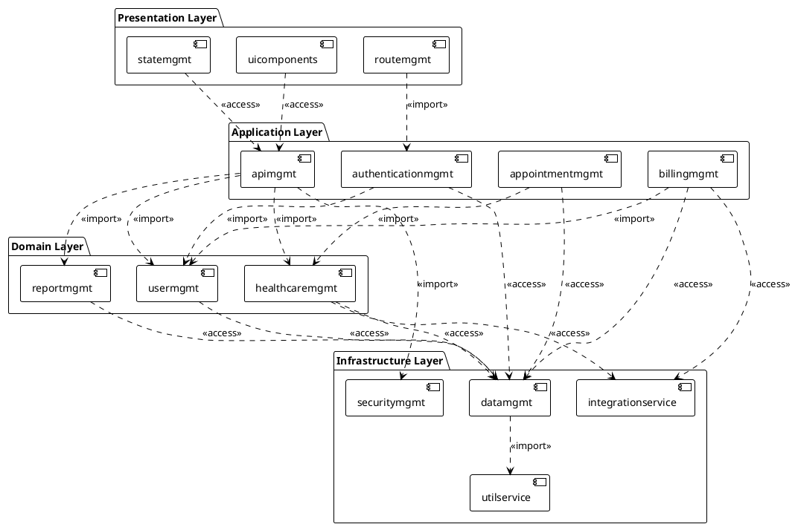

# IV.3.1. Package Diagram

## Gender Healthcare Service Management System Overview

The gender healthcare service management system follows a **strict layered architecture** pattern as per UML standards, ensuring clear separation of concerns, maintainability, and adherence to architectural best practices.

## Package Diagram



## UML Dependency Stereotypes

### **<<import>>** - Functionality Import
Used when one package imports and uses functionality from another package:
- `[routemgmt] ..> [authenticationmgmt] : <<import>>`
- `[apimgmt] ..> [usermgmt] : <<import>>`

### **<<access>>** - Service Access  
Used when one package requires access to services provided by another package:
- `[uicomponents] ..> [apimgmt] : <<access>>`
- `[usermgmt] ..> [datamgmt] : <<access>>`

## Layered Architecture Principles

### **1. Presentation Layer (Top)**
- **Responsibility**: User interface and user interaction
- **Dependencies**: Can only depend on Application Layer
- **Components**: React UI, state management, routing

### **2. Application Layer** 
- **Responsibility**: Application services and use case orchestration
- **Dependencies**: Can depend on Domain Layer and Infrastructure Layer (for technical concerns)
- **Components**: API management, authentication, business workflows

### **3. Domain Layer**
- **Responsibility**: Core business logic and entities  
- **Dependencies**: Can only depend on Infrastructure Layer for persistence
- **Components**: User management, healthcare core logic, reporting

### **4. Infrastructure Layer (Bottom)**
- **Responsibility**: Technical implementations and external integrations
- **Dependencies**: Internal dependencies only
- **Components**: Data access, external services, utilities

## Package Descriptions

| No | Package | Description |
|----|---------|-------------|
| 01 | **uicomponents** | React components and user interface elements for web application |
| 02 | **statemgmt** | Redux state management and global application state handling |  
| 03 | **routemgmt** | React routing and navigation management with route protection |
| 04 | **apimgmt** | RESTful API endpoints and request/response handling layer |
| 05 | **authenticationmgmt** | Authentication workflows and JWT session management |
| 06 | **appointmentmgmt** | Appointment booking and scheduling workflow management |
| 07 | **billingmgmt** | Payment processing and billing workflow with PayOS integration |
| 08 | **usermgmt** | User entities and core user business logic management |
| 09 | **healthcaremgmt** | Core healthcare services and medical business rules |
| 10 | **reportmgmt** | Analytics and reporting business logic for dashboards |
| 11 | **datamgmt** | MongoDB data access and persistence layer operations |
| 12 | **integrationservice** | External service integrations for Google, Cloudinary, Email services |
| 13 | **securitymgmt** | Security implementations including CORS, validation, rate limiting |
| 14 | **utilservice** | Utility functions and common libraries for cross-cutting concerns |

## Package Dependency Matrix

| From Package | To Package | Relationship | Stereotype |
|--------------|------------|--------------|------------|
| **uicomponents** | apimgmt | needs API access | `<<access>>` |
| **statemgmt** | apimgmt | needs API access | `<<access>>` |
| **routemgmt** | authenticationmgmt | imports auth logic | `<<import>>` |
| **apimgmt** | usermgmt | imports user domain | `<<import>>` |
| **apimgmt** | healthcaremgmt | imports healthcare domain | `<<import>>` |
| **apimgmt** | reportmgmt | imports reporting domain | `<<import>>` |
| **apimgmt** | securitymgmt | imports security functions | `<<import>>` |
| **authenticationmgmt** | usermgmt | imports user entities | `<<import>>` |
| **authenticationmgmt** | datamgmt | accesses data services | `<<access>>` |
| **appointmentmgmt** | healthcaremgmt | imports healthcare domain | `<<import>>` |
| **appointmentmgmt** | datamgmt | accesses data services | `<<access>>` |
| **billingmgmt** | usermgmt | imports user entities | `<<import>>` |
| **billingmgmt** | datamgmt | accesses data services | `<<access>>` |
| **billingmgmt** | integrationservice | accesses payment APIs | `<<access>>` |
| **usermgmt** | datamgmt | accesses user data | `<<access>>` |
| **healthcaremgmt** | datamgmt | accesses healthcare data | `<<access>>` |
| **healthcaremgmt** | integrationservice | accesses external APIs | `<<access>>` |
| **reportmgmt** | datamgmt | accesses reporting data | `<<access>>` |
| **datamgmt** | utilservice | imports utility functions | `<<import>>` |

## Architectural Benefits

### **1. Clear Layer Separation**
Each layer has distinct responsibilities following UML layered architecture pattern, preventing architectural violations.

### **2. Dependency Direction Control**
Dependencies flow in one direction (top to bottom), preventing circular dependencies and maintaining clean architecture.

### **3. UML Standards Compliance**
Uses proper UML stereotypes (`<<import>>` and `<<access>>`) as defined in UML specification for package dependencies.

### **4. Testability and Isolation**
Each layer can be tested independently with clear interfaces and minimal coupling.

### **5. Scalability and Maintainability**
New features can be added by extending appropriate layers without affecting other layers.

### **6. Team Development**
Different teams can work on different layers simultaneously with minimal conflicts.

---

# IV.3.2. Component Diagram

## Gender Healthcare Service Management System Components

The component diagram illustrates the main system components and their interfaces in the Gender Healthcare Service Management system, showing how different parts of the system interact through well-defined interfaces.

## Component Diagram

```plantuml
@startuml
!theme plain

package "Client Tier" {
  component [ReactApp] as ReactApp {
    portin UIInterface
    portout APIClient
  }
}

package "Web Tier" {
  component [ExpressServer] as ExpressServer {
    portin HTTPInterface
    portout DatabaseInterface
    portout ExternalAPIInterface
  }
  
  component [SecurityMiddleware] as SecurityMiddleware {
    portin RequestFilter
    portout AuthenticatedRequest
  }
  
  component [JWTAuth] as JWTAuth {
    portin AuthInterface
    portout TokenInterface
  }
}

package "Business Tier" {
  component [UserService] as UserService {
    portin UserInterface
    portout UserDataInterface
  }
  
  component [AppointmentService] as AppointmentService {
    portin BookingInterface
    portout AppointmentDataInterface
  }
  
  component [HealthcareService] as HealthcareService {
    portin HealthInterface
    portout HealthDataInterface
  }
  
  component [BillingService] as BillingService {
    portin PaymentInterface
    portout BillingDataInterface
  }
}

package "Data Tier" {
  component [MongoDBAdapter] as MongoDBAdapter {
    portin DataInterface
    portout DatabaseConnection
  }
  
  component [FileManager] as FileManager {
    portin FileInterface
    portout CloudinaryAPI
  }
}

package "External Services" {
  component [GoogleServices] as GoogleServices {
    portin GoogleInterface
  }
  
  component [CloudinaryService] as CloudinaryService {
    portin CloudinaryInterface
  }
  
  component [PayOSGateway] as PayOSGateway {
    portin PayOSInterface
  }
}

' Client to Web connections
ReactApp::APIClient --> ExpressServer::HTTPInterface : HTTPS/REST

' Security flow
ExpressServer::HTTPInterface --> SecurityMiddleware::RequestFilter
SecurityMiddleware::AuthenticatedRequest --> JWTAuth::AuthInterface
JWTAuth::TokenInterface --> ExpressServer

' Web to Business connections
ExpressServer --> UserService::UserInterface
ExpressServer --> AppointmentService::BookingInterface  
ExpressServer --> HealthcareService::HealthInterface
ExpressServer --> BillingService::PaymentInterface

' Business to Data connections
UserService::UserDataInterface --> MongoDBAdapter::DataInterface
AppointmentService::AppointmentDataInterface --> MongoDBAdapter::DataInterface
HealthcareService::HealthDataInterface --> MongoDBAdapter::DataInterface
BillingService::BillingDataInterface --> MongoDBAdapter::DataInterface

' File management
ExpressServer --> FileManager::FileInterface
FileManager::CloudinaryAPI --> CloudinaryService::CloudinaryInterface

' External service connections
ExpressServer::ExternalAPIInterface --> GoogleServices::GoogleInterface
BillingService --> PayOSGateway::PayOSInterface

@enduml
```

## Component Interface Specifications

### **Client Tier Interfaces**

| Interface | Type | Protocol | Description |
|-----------|------|----------|-------------|
| **UIInterface** | Provided | User Actions | React component user interaction interface |
| **APIClient** | Required | HTTPS/REST | HTTP client for backend API communication |

### **Web Tier Interfaces**

| Interface | Type | Protocol | Description |
|-----------|------|----------|-------------|
| **HTTPInterface** | Provided | HTTPS/REST | Express.js HTTP server endpoint interface |
| **RequestFilter** | Required | Middleware | Security middleware processing interface |
| **AuthInterface** | Required | JWT | Authentication token validation interface |
| **DatabaseInterface** | Required | MongoDB | Database connection and query interface |
| **ExternalAPIInterface** | Required | HTTPS | Third-party service integration interface |

### **Business Tier Interfaces**

| Interface | Type | Protocol | Description |
|-----------|------|----------|-------------|
| **UserInterface** | Provided | Service Call | User management business logic interface |
| **BookingInterface** | Provided | Service Call | Appointment booking business logic interface |
| **HealthInterface** | Provided | Service Call | Healthcare services business logic interface |
| **PaymentInterface** | Provided | Service Call | Payment processing business logic interface |
| **UserDataInterface** | Required | Data Access | User data persistence interface |
| **AppointmentDataInterface** | Required | Data Access | Appointment data persistence interface |
| **HealthDataInterface** | Required | Data Access | Healthcare data persistence interface |
| **BillingDataInterface** | Required | Data Access | Billing data persistence interface |

### **Data Tier Interfaces**

| Interface | Type | Protocol | Description |
|-----------|------|----------|-------------|
| **DataInterface** | Provided | Mongoose ODM | MongoDB data access layer interface |
| **FileInterface** | Provided | File Upload | File management and storage interface |
| **DatabaseConnection** | Required | MongoDB Protocol | MongoDB database connection interface |
| **CloudinaryAPI** | Required | REST API | Cloudinary file storage service interface |

### **External Service Interfaces**

| Interface | Type | Protocol | Description |
|-----------|------|----------|-------------|
| **GoogleInterface** | Provided | OAuth 2.0/REST | Google authentication and services interface |
| **CloudinaryInterface** | Provided | REST API | Cloudinary media management interface |
| **PayOSInterface** | Provided | REST API | PayOS payment gateway interface |

## Component Descriptions

| No | Component | Responsibility | Technology |
|----|-----------|----------------|------------|
| 01 | **ReactApp** | User interface and client-side application logic | React 18 + TypeScript + Redux |
| 02 | **ExpressServer** | HTTP server and API endpoint management | Node.js + Express.js + TypeScript |
| 03 | **SecurityMiddleware** | Request filtering, CORS, rate limiting, validation | Express middleware + custom security |
| 04 | **JWTAuth** | Authentication token generation and validation | JWT + bcryptjs |
| 05 | **UserService** | User management business logic and workflows | Node.js business logic |
| 06 | **AppointmentService** | Appointment booking and scheduling business logic | Node.js business logic |
| 07 | **HealthcareService** | Healthcare services and medical data business logic | Node.js business logic |
| 08 | **BillingService** | Payment processing and billing business logic | Node.js business logic |
| 09 | **MongoDBAdapter** | Database access layer and data persistence | Mongoose ODM + MongoDB |
| 10 | **FileManager** | File upload, storage and media management | Multer + file processing |
| 11 | **GoogleServices** | Google OAuth authentication and Google Meet integration | Google APIs |
| 12 | **CloudinaryService** | Media file storage and image processing | Cloudinary SDK |
| 13 | **PayOSGateway** | Payment gateway integration for Vietnamese market | PayOS API |

## Component Interaction Flows

### **1. User Authentication Flow**
```
ReactApp → ExpressServer → SecurityMiddleware → JWTAuth → UserService → MongoDBAdapter
```

### **2. Appointment Booking Flow**
```
ReactApp → ExpressServer → SecurityMiddleware → AppointmentService → MongoDBAdapter
```

### **3. File Upload Flow**
```
ReactApp → ExpressServer → FileManager → CloudinaryService
```

### **4. Payment Processing Flow**
```
ReactApp → ExpressServer → BillingService → PayOSGateway
```

### **5. Healthcare Data Access Flow**
```
ReactApp → ExpressServer → HealthcareService → MongoDBAdapter
```

## Deployment Architecture

### **Production Components**
- **ReactApp**: Deployed on CDN (Vercel/Netlify)
- **ExpressServer**: Deployed on cloud platform (Render/Railway)
- **MongoDBAdapter**: MongoDB Atlas cloud database
- **External Services**: Third-party SaaS platforms

### **Component Scalability**
- **Horizontal Scaling**: ExpressServer can be scaled horizontally
- **Database Scaling**: MongoDB Atlas automatic scaling
- **CDN Distribution**: ReactApp served from global CDN
- **Service Isolation**: Each business service can be independently scaled

---

*This component diagram follows UML 2.5 standards and shows the physical distribution and interfaces of system components in the Gender Healthcare Service Management platform.* 