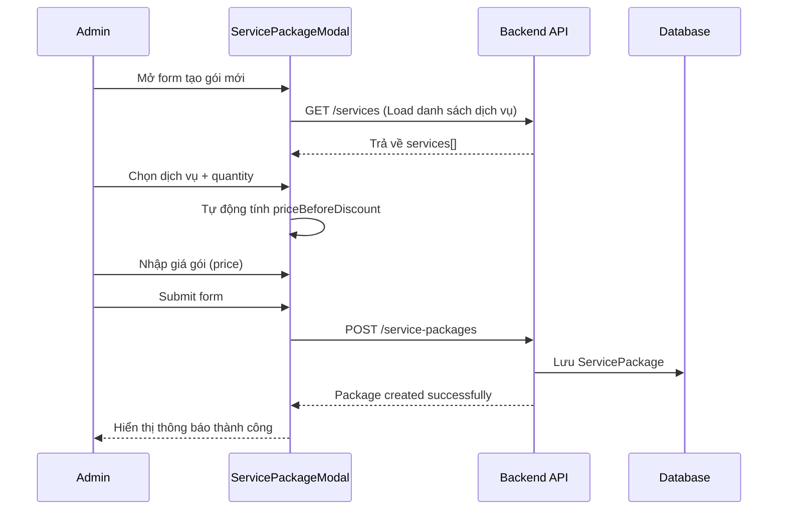
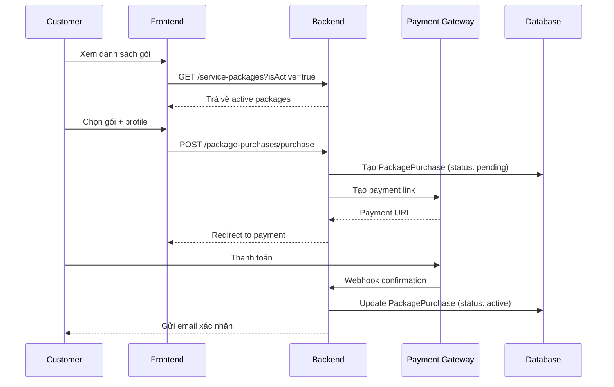
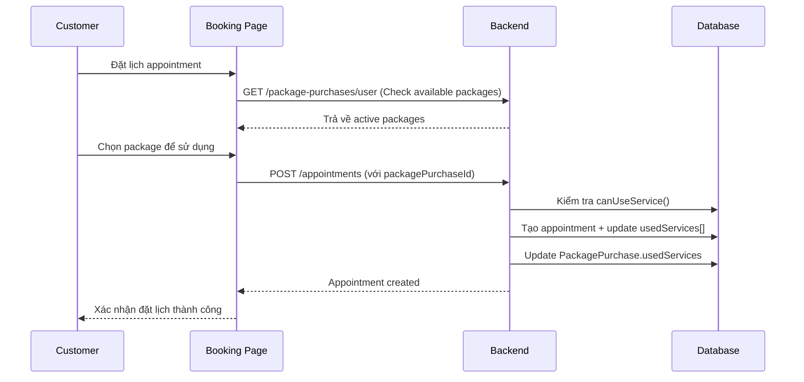
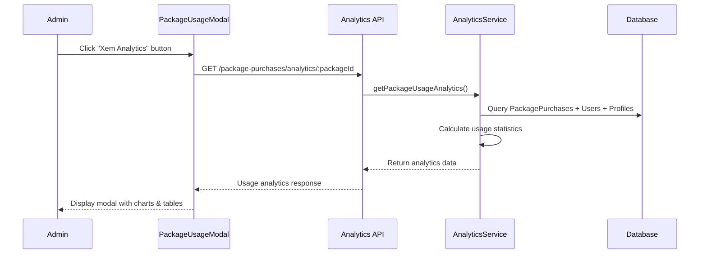

# 📋 Package Flow Guide - Hướng dẫn Luồng Gói Dịch vụ

## 📖 Tổng quan

Hệ thống Gói Dịch vụ (Service Package System) cho phép cơ sở y tế tạo ra các gói dịch vụ tích hợp, bao gồm nhiều dịch vụ với số lượng và giá ưu đãi. Khách hàng có thể mua gói và sử dụng dần theo thời gian.

---

## 🏗️ Kiến trúc System

### **1. Database Schema**

```
ServicePackages {
  _id: ObjectId
  name: String                  // Tên gói (VD: "Gói Khám Sức khỏe Cơ bản")
  description: String           // Mô tả chi tiết
  services: [{                  // Danh sách dịch vụ trong gói
    serviceId: ObjectId,        // ID dịch vụ
    quantity: Number            // Số lượng được sử dụng
  }]
  priceBeforeDiscount: Number   // Giá gốc (tổng giá các dịch vụ)
  price: Number                 // Giá gói (sau giảm giá)
  durationInDays: Number        // Thời hạn sử dụng (ngày)
  isActive: Boolean             // Trạng thái hoạt động
  createdAt: Date
  updatedAt: Date
}

PackagePurchases {
  _id: ObjectId
  userId: ObjectId              // ID người mua
  userProfileId: ObjectId       // Profile sử dụng gói
  servicePackageId: ObjectId    // ID gói dịch vụ
  purchaseDate: Date            // Ngày mua
  expiryDate: Date              // Ngày hết hạn
  purchasePrice: Number         // Giá đã mua
  usedServices: [{              // Tracking sử dụng dịch vụ
    serviceId: ObjectId,
    usedQuantity: Number,       // Số lần đã sử dụng
    appointments: [ObjectId]    // Danh sách appointments liên quan
  }]
  status: String                // 'active', 'expired', 'used_up'
  paymentStatus: String         // 'pending', 'paid', 'failed'
  billId: ObjectId              // Liên kết hóa đơn
}
```

### **2. API Endpoints**

#### **Service Package Management**
```http
# Quản lý gói dịch vụ
GET    /api/service-packages                    # Lấy danh sách gói
POST   /api/service-packages                    # Tạo gói mới
PUT    /api/service-packages/:id                # Cập nhật gói
DELETE /api/service-packages/:id                # Xóa gói
GET    /api/service-packages/:id                # Chi tiết gói

# Package Purchase
POST   /api/package-purchases/purchase          # Mua gói
GET    /api/package-purchases/user              # Gói đã mua của user
GET    /api/package-purchases/:id               # Chi tiết gói đã mua

# 🆕 Analytics & Tracking
GET    /api/package-purchases/analytics         # Tổng quan analytics
GET    /api/package-purchases/analytics/:packageId  # Analytics cho 1 gói
```

---

## 🔄 Luồng hoạt động chính

### **Flow 1: Tạo Gói Dịch vụ (Admin/Staff)**



**Các bước chi tiết:**
1. **Load Services**: Hệ thống tải danh sách tất cả dịch vụ có sẵn
2. **Service Selection**: Admin chọn dịch vụ và quantity cho từng dịch vụ
3. **Auto-calculate Price**: Giá gốc = Σ(service.price × quantity)
4. **Set Package Price**: Admin nhập giá bán (thường nhỏ hơn giá gốc)
5. **Validation**: Kiểm tra giá gói ≤ giá gốc
6. **Save Package**: Lưu vào database

### **Flow 2: Khách hàng mua Gói (Customer)**



### **Flow 3: Sử dụng Dịch vụ trong Gói (Customer)**



**Package Usage Logic:**
```typescript
// Backend service logic
canUseService(serviceId: string): boolean {
  const serviceUsage = this.usedServices.find(us => us.serviceId === serviceId);
  const packageService = this.servicePackage.services.find(ps => ps.serviceId === serviceId);
  
  if (!packageService) return false;
  
  const usedQuantity = serviceUsage?.usedQuantity || 0;
  return usedQuantity < packageService.quantity;
}

useService(serviceId: string, appointmentId: string): void {
  const serviceUsage = this.usedServices.find(us => us.serviceId === serviceId);
  
  if (serviceUsage) {
    serviceUsage.usedQuantity += 1;
    serviceUsage.appointments.push(appointmentId);
  } else {
    this.usedServices.push({
      serviceId,
      usedQuantity: 1,
      appointments: [appointmentId]
    });
  }
}
```

### **Flow 4: Analytics & Tracking (Admin/Manager)**



**Analytics Data Structure:**
```typescript
interface PackageAnalytics {
  packageInfo: {
    id: string;
    name: string;
    totalSold: number;
    totalRevenue: number;
  };
  usageStatistics: {
    activeUsers: number;
    expiredUsers: number;
    usedUpUsers: number;
    averageUsagePercentage: number;
  };
  serviceBreakdown: {
    serviceId: string;
    serviceName: string;
    totalAllocated: number;
    totalUsed: number;
    usagePercentage: number;
  }[];
  userUsages: UserPackageUsage[];
}
```

---

## 🎯 Key Features

### **1. Flexible Quantity Management**
- ✅ Admin có thể set quantity khác nhau cho từng dịch vụ trong gói
- ✅ Khách hàng sử dụng dần theo từng lần appointment
- ✅ Tracking chính xác số lần đã sử dụng/còn lại

### **2. Smart Pricing**
- ✅ Tự động tính giá gốc từ tổng dịch vụ
- ✅ Admin set giá bán ưu đãi
- ✅ Validation giá bán ≤ giá gốc

### **3. Comprehensive Analytics**
- ✅ Tracking usage per user
- ✅ Service utilization statistics  
- ✅ Revenue analytics
- ✅ User behavior insights

### **4. Expiry Management**
- ✅ Automatic status updates (active → expired)
- ✅ Prevent usage after expiry
- ✅ Grace period handling

---

## 🧪 Testing Scenarios

### **Test Case 1: Tạo gói với nhiều dịch vụ**
```
Input: 
- Dịch vụ A (50,000 VNĐ) x 2 lần
- Dịch vụ B (80,000 VNĐ) x 1 lần
- Giá gốc: 180,000 VNĐ
- Giá bán: 150,000 VNĐ

Expected: Package tạo thành công với discount 16.7%
```

### **Test Case 2: Sử dụng gói**
```
Scenario: Customer đã mua gói trên
1. Đặt lịch Dịch vụ A → Success (1/2 used)
2. Đặt lịch Dịch vụ A → Success (2/2 used)  
3. Đặt lịch Dịch vụ A → Error (exceed limit)
4. Đặt lịch Dịch vụ B → Success (1/1 used)
5. Package status → 'used_up'
```

### **Test Case 3: Expiry handling**
```
Scenario: Package expires before full usage
1. Package có 30 ngày sử dụng
2. Sau 30 ngày: status → 'expired'
3. Customer đặt lịch → Error (package expired)
4. Analytics hiển thị expired packages
```

---

## 🔍 Common Issues & Solutions

### **Issue 1: useForm Warning**
**Problem**: `Instance created by useForm is not connected to any Form element`
**Solution**: Thêm setTimeout cho form.resetFields() để đảm bảo form đã mount

### **Issue 2: Quantity không chỉnh sửa được**
**Problem**: InputNumber bị disabled khi có multiple services
**Solution**: Remove disabled logic, cho phép user tự do điều chỉnh quantity

### **Issue 3: Price calculation sai**
**Problem**: Giá gốc không cập nhật khi thay đổi quantity
**Solution**: Trigger handleServicesChange() mỗi khi quantity thay đổi

---

## 📈 Future Enhancements

1. **Bundle Packages**: Gói chứa các gói con
2. **Subscription Packages**: Gói theo tháng/năm
3. **Dynamic Pricing**: Giá thay đổi theo thời gian
4. **Loyalty Points**: Tích điểm từ package usage
5. **Package Transfers**: Chuyển gói giữa các users
6. **Advanced Analytics**: Predictive analytics, churn analysis

---

## 📝 Changelog

| Version | Date | Changes |
|---------|------|---------|
| 1.0.0 | 2024-01-XX | Initial package system |
| 1.1.0 | 2024-01-XX | Added analytics & tracking |
| 1.1.1 | 2024-01-XX | Fixed quantity editing & useForm warning |

---

*Tài liệu này được cập nhật thường xuyên. Vui lòng check version mới nhất.* 