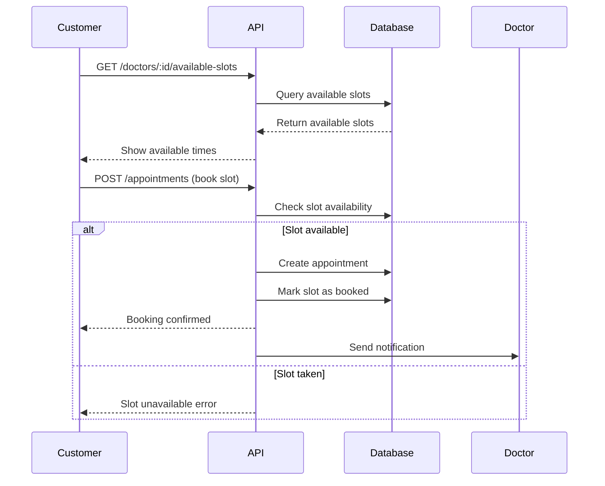

# BÁO CÁO TIẾN ĐỘ DỰ ÁN GENDER HEALTHCARE

## 📋 TỔNG QUAN DỰ ÁN

**Tên dự án**: Phần mềm Quản lý Dịch vụ Chăm sóc Sức khỏe Giới tính  
**Mục tiêu**: Hỗ trợ cơ sở y tế quản lý và cung cấp dịch vụ chăm sóc sức khỏe giới tính hiệu quả, bảo mật  
**Tech Stack**: 
- **Frontend**: React + TypeScript + Vite + TailwindCSS + Ant Design
- **Backend**: Node.js + Express + TypeScript + MongoDB + Mongoose

---

## 🔍 PHÂN TÍCH ERD (Entity Relationship Diagram)

### 📊 Các Thực Thể Chính

#### 1. **Users (Người dùng)**
- Vai trò: `guest`, `customer`, `doctor`, `staff`, `manager`, `admin`
- Thông tin cơ bản: email, password, fullName, phone, avatar, gender, address
- Trạng thái: emailVerified, isActive

#### 2. **Doctors (Bác sĩ)**
- Thông tin chuyên môn: bio, experience, rating, specialization, education, certificate
- Liên kết với Users qua `userId`

#### 3. **DoctorSchedules (Lịch làm việc bác sĩ)**
- **Cấu trúc lịch**: 
  - `weekSchedule[]`: Mảng các ngày trong tuần
  - Mỗi ngày có `slots[]`: Các khung giờ
  - Mỗi slot có `slotTime` và `isBooked`

#### 4. **Appointments (Cuộc hẹn)**
- Loại: `consultation`, `test`, `other`
- Địa điểm: `clinic`, `home`, `Online`
- Trạng thái: `pending`, `confirmed`, `completed`, `cancelled`

#### 5. **Services & ServicePackages (Dịch vụ & Gói dịch vụ)**
- Dịch vụ đơn lẻ và gói dịch vụ combo
- Hỗ trợ khuyến mãi qua bảng Promotions

#### 6. **MenstrualCycles (Chu kỳ kinh nguyệt)**
- Theo dõi chu kỳ sinh lý của người dùng
- Có thể tạo nhiều profile cho gia đình

#### 7. **TestResults & TestCategories (Kết quả xét nghiệm)**
- Quản lý kết quả xét nghiệm STI
- Phân loại theo các chỉ số y tế

---

## 🚧 TÌNH TRẠNG API HIỆN TẠI

### ✅ **API ĐÃ HOÀN THÀNH**

#### **Authentication APIs**
- `POST /auth/register` - Đăng ký tài khoản
- `POST /auth/login` - Đăng nhập
- `POST /auth/login-admin` - Đăng nhập admin
- `POST /auth/login-google` - Đăng nhập Google
- `POST /auth/verify-email` - Xác thực email
- `POST /auth/logout` - Đăng xuất
- `POST /auth/refresh-token` - Làm mới token
- `POST /auth/forgot-password` - Quên mật khẩu
- `POST /auth/reset-password` - Đặt lại mật khẩu
- `POST /auth/check-email` - Kiểm tra email
- `POST /auth/check-phone` - Kiểm tra số điện thoại

#### **User Management APIs**
- `GET /users/profile/me` - Lấy thông tin cá nhân
- `PUT /users/profile/me` - Cập nhật thông tin cá nhân
- `PUT /users/profile/me/avatar` - Cập nhật avatar
- `PUT /users/profile/me/change-password` - Đổi mật khẩu
- `POST /users/profile/me/avatar/upload` - Upload avatar

#### **Login History APIs**
- Theo dõi lịch sử đăng nhập

### ❌ **API CHƯA ĐƯỢC IMPLEMENT**

#### **1. Doctor Management APIs**
```
GET    /doctors                    # Danh sách bác sĩ
GET    /doctors/:id                # Chi tiết bác sĩ
POST   /doctors                    # Tạo hồ sơ bác sĩ (Admin)
PUT    /doctors/:id                # Cập nhật hồ sơ bác sĩ
DELETE /doctors/:id                # Xóa bác sĩ
```

#### **2. Doctor Schedule APIs** 
```
GET    /doctors/:id/schedules      # Lịch làm việc bác sĩ
POST   /doctors/:id/schedules      # Tạo lịch làm việc
PUT    /doctors/:id/schedules      # Cập nhật lịch làm việc
DELETE /doctors/:id/schedules/:scheduleId  # Xóa lịch
GET    /doctors/:id/available-slots # Slot trống theo ngày
```

#### **3. Appointment APIs**
```
GET    /appointments               # Danh sách cuộc hẹn
POST   /appointments               # Đặt lịch hẹn
GET    /appointments/:id           # Chi tiết cuộc hẹn
PUT    /appointments/:id           # Cập nhật cuộc hẹn
DELETE /appointments/:id           # Hủy cuộc hẹn
PUT    /appointments/:id/status    # Thay đổi trạng thái
```

#### **4. Service Management APIs**
```
GET    /services                   # Danh sách dịch vụ
POST   /services                   # Tạo dịch vụ mới
PUT    /services/:id               # Cập nhật dịch vụ
DELETE /services/:id               # Xóa dịch vụ
GET    /service-packages           # Danh sách gói dịch vụ
POST   /service-packages           # Tạo gói dịch vụ
```

#### **5. Menstrual Cycle APIs**
```
GET    /profiles/:id/cycles        # Chu kỳ của profile
POST   /profiles/:id/cycles        # Thêm chu kỳ mới
PUT    /cycles/:id                 # Cập nhật chu kỳ
DELETE /cycles/:id                 # Xóa chu kỳ
```

#### **6. Medication Reminder APIs**
```
GET    /profiles/:id/medications   # Lịnh nhắc thuốc
POST   /profiles/:id/medications   # Tạo nhắc thuốc
PUT    /medications/:id            # Cập nhật nhắc thuốc
DELETE /medications/:id            # Xóa nhắc thuốc
```

#### **7. Test Result APIs**
```
GET    /appointments/:id/tests     # Danh sách test của cuộc hẹn
POST   /appointments/:id/tests     # Tạo test mới
GET    /tests/:id/results          # Kết quả test
POST   /tests/:id/results          # Upload kết quả
PUT    /tests/:id/results          # Cập nhật kết quả
```

#### **8. Blog Management APIs**
```
GET    /blogs                      # Danh sách blog
POST   /blogs                      # Tạo blog mới
GET    /blogs/:slug                # Chi tiết blog
PUT    /blogs/:id                  # Cập nhật blog
DELETE /blogs/:id                  # Xóa blog
PUT    /blogs/:id/publish          # Xuất bản blog
```

#### **9. User Profile Management APIs**
```
GET    /profiles                   # Danh sách profile của user
POST   /profiles                   # Tạo profile mới (gia đình)
GET    /profiles/:id               # Chi tiết profile
PUT    /profiles/:id               # Cập nhật profile
DELETE /profiles/:id               # Xóa profile
```

#### **10. Q&A System APIs**
```
GET    /doctor-qa                  # Danh sách câu hỏi
POST   /doctor-qa                  # Gửi câu hỏi
GET    /doctor-qa/:id              # Chi tiết câu hỏi
PUT    /doctor-qa/:id              # Cập nhật trạng thái
POST   /doctor-qa/:id/answer       # Trả lời câu hỏi
```

#### **11. Feedback & Rating APIs**
```
GET    /feedbacks                  # Danh sách feedback
POST   /feedbacks                  # Gửi feedback
GET    /doctors/:id/feedbacks      # Feedback của bác sĩ
GET    /services/:id/feedbacks     # Feedback của dịch vụ
```

#### **12. Billing & Payment APIs**
```
GET    /bills                      # Danh sách hóa đơn
POST   /bills                      # Tạo hóa đơn
GET    /bills/:id                  # Chi tiết hóa đơn
POST   /bills/:id/payment          # Thanh toán
GET    /payments                   # Lịch sử thanh toán
```

#### **13. Admin & Manager APIs**
```
GET    /admin/users                # Quản lý người dùng
PUT    /admin/users/:id/role       # Thay đổi vai trò
GET    /admin/statistics           # Thống kê tổng quan
GET    /admin/reports              # Báo cáo chi tiết
GET    /manager/dashboard          # Dashboard quản lý
```

#### **14. System Configuration APIs**
```
GET    /system/configs             # Cấu hình hệ thống
PUT    /system/configs/:key        # Cập nhật cấu hình
```

---

## 🎨 TÌNH TRẠNG FRONTEND PAGES

### ✅ **PAGES ĐÃ CÓ**
- `/home` - Trang chủ
- `/auth/login` - Đăng nhập
- `/auth/register` - Đăng ký
- `/about-gcc` - Giới thiệu
- `/blog` - Blog
- `/services` - Dịch vụ
- `/counselors` - Tư vấn viên
- `/booking` - Đặt lịch
- `/booking-history` - Lịch sử đặt lịch
- `/profile` - Hồ sơ cá nhân
- `/feedback` - Phản hồi
- `/picture` - Hình ảnh
- `/demo` - Demo
- `/notFound` - Trang 404

### ❌ **ADMIN PAGES CHƯA CÓ**

#### **1. Dashboard Admin**
```
/admin/dashboard              # Tổng quan hệ thống
/admin/analytics             # Phân tích dữ liệu
```

#### **2. User Management**
```
/admin/users                 # Quản lý người dùng
/admin/users/create          # Tạo người dùng mới
/admin/users/:id/edit        # Chỉnh sửa người dùng
/admin/users/:id/detail      # Chi tiết người dùng
```

#### **3. Doctor Management**
```
/admin/doctors               # Quản lý bác sĩ
/admin/doctors/create        # Thêm bác sĩ mới
/admin/doctors/:id/edit      # Chỉnh sửa bác sĩ
/admin/doctors/:id/schedule  # Quản lý lịch làm việc
```

#### **4. Service Management**
```
/admin/services              # Quản lý dịch vụ
/admin/services/create       # Tạo dịch vụ mới
/admin/service-packages      # Quản lý gói dịch vụ
/admin/service-packages/create # Tạo gói dịch vụ
```

#### **5. Appointment Management**
```
/admin/appointments          # Quản lý cuộc hẹn
/admin/appointments/:id      # Chi tiết cuộc hẹn
```

#### **6. Blog Management**
```
/admin/blogs                 # Quản lý blog
/admin/blogs/create          # Tạo blog mới
/admin/blogs/:id/edit        # Chỉnh sửa blog
/admin/blog-categories       # Quản lý danh mục
```

#### **7. Test Result Management**
```
/admin/test-results          # Quản lý kết quả xét nghiệm
/admin/test-categories       # Quản lý danh mục xét nghiệm
```

#### **8. Financial Management**
```
/admin/bills                 # Quản lý hóa đơn
/admin/payments              # Quản lý thanh toán
/admin/promotions            # Quản lý khuyến mãi
```

#### **9. Q&A Management**
```
/admin/doctor-qa             # Quản lý hỏi đáp
/admin/feedbacks             # Quản lý phản hồi
```

#### **10. System Settings**
```
/admin/settings              # Cài đặt hệ thống
/admin/staff                 # Quản lý nhân viên
```

### ❌ **USER PAGES CHƯA CÓ**

#### **1. Advanced Profile Management**
```
/profile/family              # Quản lý hồ sơ gia đình
/profile/family/create       # Tạo hồ sơ gia đình
/profile/medical-history     # Lịch sử y tế
```

#### **2. Menstrual Cycle Tracking**
```
/health/cycle                # Theo dõi chu kỳ
/health/cycle/add            # Thêm chu kỳ mới
/health/medications          # Nhắc thuốc
/health/symptoms             # Theo dõi triệu chứng
```

#### **3. Advanced Booking**
```
/booking/consultation        # Đặt lịch tư vấn
/booking/test               # Đặt lịch xét nghiệm
/booking/package            # Đặt gói dịch vụ
```

#### **4. Test Results**
```
/results                    # Kết quả xét nghiệm
/results/:id                # Chi tiết kết quả
```

#### **5. Q&A System**
```
/qa                         # Hỏi đáp
/qa/ask                     # Đặt câu hỏi
/qa/:id                     # Chi tiết câu hỏi
```

#### **6. Payment & Billing**
```
/billing                    # Hóa đơn
/billing/:id                # Chi tiết hóa đơn
/payment                    # Thanh toán
/payment/history            # Lịch sử thanh toán
```

---

## ⚙️ LOGIC BÁC SĨ VÀ LỊCH LÀM VIỆC

### 📅 **Cấu trúc Lịch Làm Việc**

#### **1. DoctorSchedules Schema**
```typescript
interface DoctorSchedule {
  _id: ObjectId;
  doctorId: ObjectId;          // Tham chiếu đến Doctors
  weekSchedule: WeekSchedule[]; // Mảng 7 ngày trong tuần
  createdAt: Date;
  updatedAt: Date;
}

interface WeekSchedule {
  _id: ObjectId;
  dayOfWeek: string;           // "Monday", "Tuesday", ...
  slots: TimeSlot[];           // Các khung giờ trong ngày
}

interface TimeSlot {
  _id: ObjectId;
  slotTime: string;            // "08:00", "09:00", "14:00"
  isBooked: boolean;           // Đã được đặt hay chưa
}
```

#### **2. Quy trình Quản lý Lịch**

##### **A. Tạo Lịch Làm Việc (Doctor/Admin)**
1. **Input**: Chọn ngày trong tuần và khung giờ
2. **Validation**: 
   - Kiểm tra conflict với lịch hiện tại
   - Đảm bảo khung giờ hợp lệ (8:00-17:00)
   - Tối thiểu 30 phút/slot, tối đa 60 phút/slot
3. **Storage**: Lưu vào `DoctorSchedules.weekSchedule`

##### **B. Đặt Lịch Hẹn (Customer)**
1. **Hiển thị lịch trống**:
   ```typescript
   GET /doctors/:id/available-slots?date=2024-01-15
   // Trả về: slots có isBooked = false
   ```

2. **Đặt lịch**:
   ```typescript
   POST /appointments
   {
     doctorId: "...",
     appointmentDate: "2024-01-15",
     appointmentTime: "09:00",
     slotId: "embedded_slot_id"
   }
   ```

3. **Cập nhật trạng thái**:
   - Set `slot.isBooked = true`
   - Tạo record trong `Appointments`

##### **C. Hủy/Thay đổi Lịch**
1. **Hủy lịch**: Set `slot.isBooked = false`
2. **Thay đổi lịch**: Hủy slot cũ + đặt slot mới
3. **Notification**: Gửi thông báo cho bác sĩ và bệnh nhân

#### **3. Business Rules**

##### **Quy tắc Đặt lịch**
- Chỉ đặt được lịch trong tương lai (>= ngày hiện tại)
- Một slot chỉ được một người đặt
- Customer có thể đặt nhiều lịch với cùng bác sĩ
- Phải xác nhận trước khi hoàn tất đặt lịch

##### **Quy tắc Bác sĩ**
- Bác sĩ có thể tự cập nhật lịch làm việc
- Admin/Manager có quyền chỉnh sửa lịch mọi bác sĩ
- Không được xóa slot đã có người đặt
- Có thể thêm slot mới nếu không conflict

##### **Quy tắc Thời gian**
- Slot mặc định: 30 phút
- Giờ làm việc: 8:00 - 17:00
- Nghỉ trưa: 12:00 - 13:00 (optional)
- Không làm việc: Chủ nhật và ngày lễ

### 🔄 **Workflow Đặt lịch**



### 📊 **Trạng thái Cuộc hẹn**

#### **Appointment Status Flow**
```
pending → confirmed → completed
   ↓
cancelled (có thể từ bất kỳ trạng thái nào)
```

#### **Chi tiết từng trạng thái**
- **pending**: Vừa đặt, chờ xác nhận
- **confirmed**: Bác sĩ/Staff đã xác nhận
- **completed**: Đã hoàn thành cuộc hẹn
- **cancelled**: Đã hủy (Customer hoặc Doctor)

---

## 📈 **ĐỀ XUẤT ROADMAP PHÁT TRIỂN**

### **Phase 1: Core APIs (2 tuần)**
1. Doctor Management APIs
2. Doctor Schedule APIs  
3. Appointment APIs
4. Basic Service APIs

### **Phase 2: Advanced Features (2 tuần)**
1. Menstrual Cycle APIs
2. Test Result APIs
3. User Profile APIs
4. Q&A System APIs

### **Phase 3: Admin Dashboard (1 tuần)**
1. Admin Dashboard Pages
2. User Management Pages
3. Doctor Management Pages
4. Appointment Management Pages

### **Phase 4: Financial & Analytics (1 tuần)**
1. Billing & Payment APIs
2. Feedback & Rating APIs
3. Statistics & Reporting APIs
4. System Configuration APIs

### **Phase 5: Frontend Integration (2 tuần)**
1. User Health Tracking Pages
2. Advanced Booking Pages
3. Payment & Billing Pages
4. Q&A System Pages

---

## 🎯 **KẾT LUẬN VÀ KHUYẾN NGHỊ**

### **Tình trạng hiện tại**
- ✅ **Hoàn thành**: Authentication & Basic User Management (~15%)
- 🚧 **Đang thiếu**: Core business logic APIs (~70%)
- ❌ **Chưa bắt đầu**: Admin dashboard & Advanced features (~15%)

### **Ưu tiên cao nhất**
1. **Doctor Schedule Management** - Cốt lõi của hệ thống đặt lịch
2. **Appointment System** - Nghiệp vụ chính
3. **Admin Dashboard** - Quản trị hệ thống
4. **Test Result Management** - Tính năng đặc thù y tế

### **Rủi ro và thách thức**
- Thiếu APIs cốt lõi ảnh hưởng đến timeline
- Logic đặt lịch phức tạp cần test kỹ lưỡng
- Admin dashboard thiếu hoàn toàn
- Chưa có hệ thống thanh toán

### **Khuyến nghị kỹ thuật**
1. Implement APIs theo thứ tự ưu tiên
2. Tạo test cases chi tiết cho logic đặt lịch
3. Sử dụng transaction cho các thao tác quan trọng
4. Implement caching cho dữ liệu tra cứu thường xuyên 