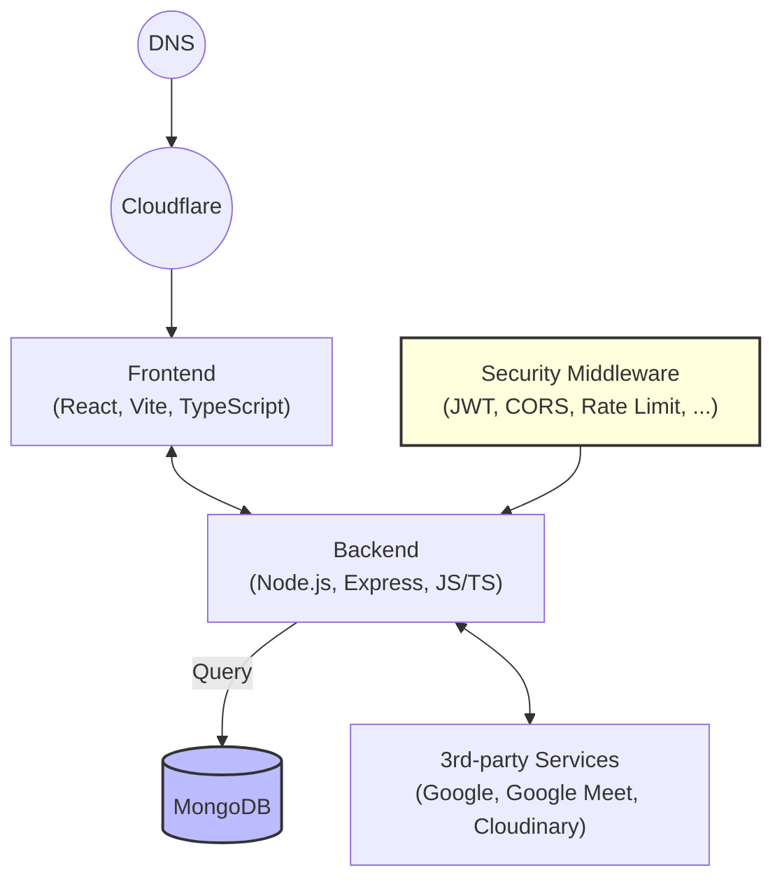

# System Architecture

## Tổng quan kiến trúc hệ thống

## API Architecture

### Dashboard APIs
- **GET /api/dashboard/management** - Dashboard cho Admin/Manager
- **GET /api/dashboard/operational** - Dashboard cho Staff/Doctor

### Authentication & User Management
- **POST /api/auth/login** - Đăng nhập
- **POST /api/auth/register** - Đăng ký
- **GET /api/users** - Quản lý người dùng (Admin/Manager)

### Login History
- **GET /api/login-history** - Lấy lịch sử đăng nhập (Admin/Manager)
- **GET /api/login-history/:userId** - Lịch sử theo user
- **POST /api/login-history** - Tạo record đăng nhập

### Medical Services
- **GET /api/doctors** - Quản lý bác sĩ
- **GET /api/services** - Quản lý dịch vụ y tế
- **GET /api/service-packages** - Gói dịch vụ
- **GET /api/appointments** - Quản lý lịch hẹn

### Health Data
- **GET /api/medical-records** - Hồ sơ y tế
- **GET /api/medicines** - Quản lý thuốc
- **GET /api/medication-reminders** - Nhắc nhở uống thuốc

## Giải thích các thành phần

- **DNS:** Quản lý tên miền, chuyển domain thành IP.
- **Cloudflare:** CDN, bảo mật, chống DDoS, tăng tốc truy cập frontend.
- **Frontend:** Giao diện người dùng, xây dựng bằng React, Vite, TypeScript.
- **Backend:** Xử lý logic nghiệp vụ, API, xác thực, kết nối database, tích hợp dịch vụ ngoài.
- **Security Middleware:** Các lớp bảo mật như JWT, CORS, rate limit, input validation.
- **MongoDB:** Lưu trữ dữ liệu trung tâm cho toàn hệ thống.
- **3rd-party Services:** Tích hợp các dịch vụ ngoài như Google (xác thực, Meet), Cloudinary (lưu trữ file/media).

## Luồng dữ liệu chính
- Người dùng truy cập domain → DNS → Cloudflare → Frontend.
- Frontend gửi request đến Backend (API).
- Backend xác thực, xử lý logic, truy vấn MongoDB hoặc gọi dịch vụ ngoài (Google, Cloudinary...).
- Kết quả trả về Frontend cho người dùng. 