# TÀI LIỆU LUỒNG LÀM VIỆC HỆ THỐNG XÉT NGHIỆM STI

## TỔNG QUAN KIẾN TRÚC

### 🏗️ KIẾN TRÚC TỔNG QUÁT
Hệ thống xét nghiệm STI được thiết kế theo mô hình 3 lớp chính với workflow đơn giản nhưng hiệu quả:

```
┌─────────────────────────────────────────────────────────────┐
│                    STI TESTING WORKFLOW                     │
├─────────────────┬─────────────────┬─────────────────────────┤
│  CONFIGURATION  │   APPOINTMENT   │        RESULTS          │
│                 │                 │                         │
│ TestCategories  │  Appointments   │    TestResults          │
│       ↕         │       ↕         │         ↕               │
│ServiceTestCat..│                 │  TestResultItems        │
│                 │                 │                         │
└─────────────────┴─────────────────┴─────────────────────────┘
```

---

## 📊 CẤU TRÚC DATABASE VÀ RELATIONSHIPS

### **1. TestCategories (Test Parameter Repository)**
```typescript
interface ITestCategories {
  _id: ObjectId              // Primary Key
  name: string [unique]      // Tên xét nghiệm (VD: "HIV", "Syphilis", "Gonorrhea")
  description?: string       // Mô tả chi tiết xét nghiệm
  unit?: string             // Đơn vị đo (VD: "IU/mL", "mg/dL")
  normalRange?: string      // Khoảng giá trị bình thường (VD: "0-10")
  createdAt: DateTime       // Thời gian tạo
  updatedAt: DateTime       // Thời gian cập nhật
}
```

**📋 Chức năng:**
- **Master Data**: Định nghĩa các loại xét nghiệm STI có sẵn
- **Reference Library**: Cung cấp thông tin tham chiếu cho validation
- **Standards Repository**: Lưu trữ các tiêu chuẩn và normal ranges

### **2. ServiceTestCategories (Service-Test Mapping)**
```typescript
interface IServiceTestCategories {
  _id: ObjectId                                    // Primary Key
  serviceId: ObjectId [ref: Services._id]         // Dịch vụ nào
  testCategoryId: ObjectId [ref: TestCategories._id] // Xét nghiệm nào
  isRequired: boolean [default: true]             // Bắt buộc hay tùy chọn
  createdAt: DateTime                             // Thời gian cấu hình
}
```

**📋 Chức năng:**
- **Service Configuration**: Định nghĩa dịch vụ nào bao gồm xét nghiệm nào
- **Package Management**: Quản lý gói xét nghiệm tổng hợp
- **Requirements Control**: Xác định xét nghiệm bắt buộc vs tùy chọn

### **3. TestResults (Main Results Container)**
```typescript
interface ITestResults {
  _id: ObjectId                                    // Primary Key
  appointmentId: ObjectId [ref: Appointments._id] // Cuộc hẹn nào
  profileId: ObjectId [ref: UserProfiles._id]     // Bệnh nhân nào
  doctorId: ObjectId [ref: Doctors._id]           // Bác sĩ nào
  conclusion?: string                              // Kết luận tổng quát
  recommendations?: string                         // Khuyến nghị của bác sĩ
  createdAt: DateTime                             // Thời gian tạo kết quả
}
```

**📋 Chức năng:**
- **Results Container**: Chứa kết quả tổng quát của một xét nghiệm
- **Medical Opinion**: Lưu trữ kết luận và khuyến nghị của bác sĩ
- **Patient Tracking**: Link với bệnh nhân và bác sĩ

### **4. TestResultItems (Detailed Measurements)**
```typescript
interface ITestResultItems {
  _id: ObjectId                                     // Primary Key
  testResultId: ObjectId [ref: TestResults._id]    // Thuộc kết quả nào
  itemNameId: ObjectId [ref: TestCategories._id]   // Tham số nào được đo
  value: string                                     // Giá trị đo được
  unit?: string                                     // Đơn vị (có thể override từ category)
  currentRange?: string                             // Range hiện tại (có thể override)
  flag?: "high" | "low" | "normal"                 // Cờ đánh giá
}
```

**📋 Chức năng:**
- **Detailed Measurements**: Lưu trữ từng giá trị đo cụ thể
- **Quality Flags**: Đánh giá cao/thấp/bình thường
- **Flexible Units**: Cho phép override unit và range

---

## 🔄 LUỒNG LÀM VIỆC CHI TIẾT

### **PHASE 1: SYSTEM SETUP & CONFIGURATION**

#### **1.1 Thiết lập Test Categories**
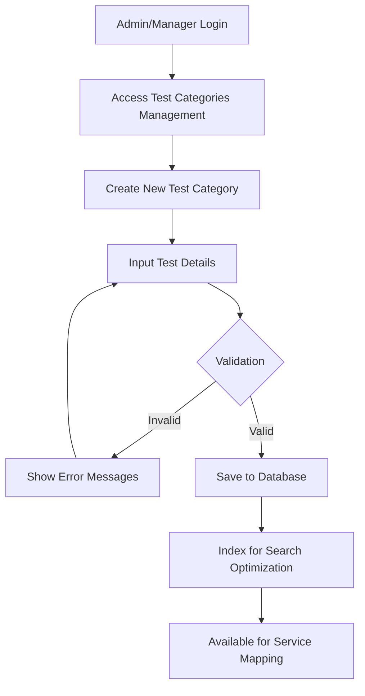

**📝 Business Rules:**
- **Unique Names**: Mỗi test category phải có tên duy nhất
- **Required Fields**: Name là bắt buộc, description, unit, normalRange là tùy chọn
- **Data Validation**: Normal range phải theo format hợp lệ
- **Access Control**: Chỉ Admin/Manager mới được tạo/sửa/xóa

#### **1.2 Service-Test Mapping**
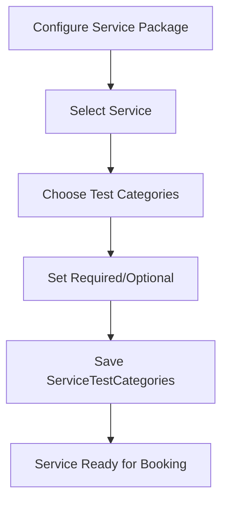

**📝 Business Rules:**
- **Many-to-Many**: Một service có thể có nhiều test categories
- **Requirement Control**: Mỗi test có thể required hoặc optional
- **Dynamic Configuration**: Có thể thay đổi cấu hình mà không ảnh hưởng booking cũ

### **PHASE 2: CUSTOMER BOOKING & APPOINTMENT**

#### **2.1 Service Booking Flow**
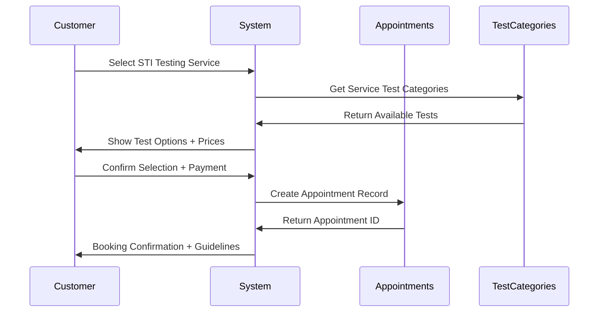

**📝 Data Flow:**
```typescript
// 1. Lấy tests có sẵn cho service
const availableTests = await ServiceTestCategories.find({ 
  serviceId: selectedServiceId 
}).populate('testCategoryId');

// 2. Tạo appointment với test information
const appointment = await Appointments.create({
  profileId: profileId,
  appointmentDate: selectedDate,
  appointmentTime: selectedTime,
  serviceId: selectedServiceId,
  status: 'confirmed'
});
```

### **PHASE 3: LABORATORY PROCESSING**

#### **3.1 Sample Collection**
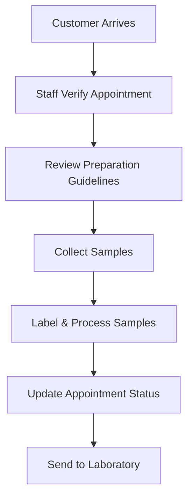

#### **3.2 Results Entry Workflow**
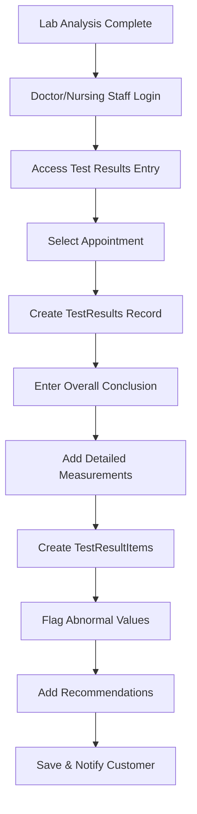

**📝 Detailed Implementation:**
```typescript
// 1. Tạo TestResults chính
const testResult = await TestResults.create({
  appointmentId: appointmentId,
  profileId: profileId,
  doctorId: doctorId,
  conclusion: "Overall assessment...",
  recommendations: "Doctor recommendations..."
});

// 2. Thêm từng measurement chi tiết
const measurements = [
  {
    testResultId: testResult._id,
    itemNameId: hivTestCategoryId,
    value: "Negative",
    flag: "normal"
  },
  {
    testResultId: testResult._id,
    itemNameId: syphilisTestCategoryId,
    value: "Positive",
    flag: "high"
  }
];

await TestResultItems.insertMany(measurements);
```

### **PHASE 4: CUSTOMER ACCESS & FOLLOW-UP**

#### **4.1 Results Viewing Flow**
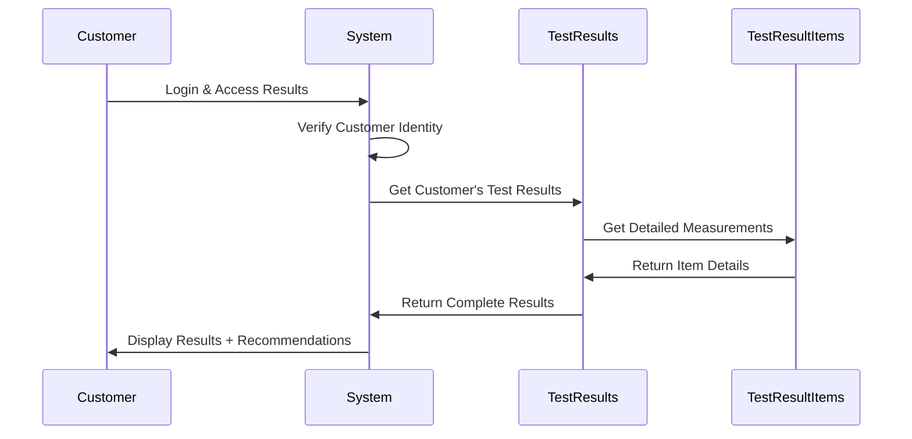

#### **4.2 Results Display Structure**
```typescript
// Frontend display format
interface DisplayTestResult {
  testName: string;
  orderDate: Date;
  resultDate: Date;
  overallStatus: "Normal" | "Abnormal" | "Pending";
  conclusion: string;
  recommendations: string;
  detailedMeasurements: Array<{
    parameter: string;
    value: string;
    unit: string;
    normalRange: string;
    flag: "high" | "low" | "normal";
    status: "Normal" | "High" | "Low";
  }>;
  doctorNotes: string;
}
```

---

## 🔐 BẢO MẬT VÀ PHÂN QUYỀN

### **Role-Based Access Control - STAFF FOCUSED**

#### **👩‍💼 Staff** (PRIMARY SYSTEM MANAGEMENT ROLE)
```typescript
const staffPermissions = {
  // === TEST MANAGEMENT ===
  testCategories: ["read", "search", "filter"],
  serviceTestCategories: ["read", "view_mappings"],
  testResults: ["read", "basic_statistics", "export_reports"],
  testResultItems: ["read", "view_details"],
  
  // === APPOINTMENT MANAGEMENT (CORE RESPONSIBILITY) ===
  appointments: ["create", "read", "update", "delete", "manage_all"],
  appointmentManagement: ["full_access"], // Staff chịu trách nhiệm chính quản lý lịch hẹn
  patientScheduling: ["full_access"], // Lên lịch cho bệnh nhân
  statusManagement: ["update_any_status"], // Cập nhật trạng thái bất kỳ
  appointmentRescheduling: ["full_access"], // Đổi lịch cho bệnh nhân
  appointmentCancellation: ["full_access"], // Hủy lịch hẹn
  
  // === CUSTOMER SERVICE ===
  customerSupport: ["full_access"], // Hỗ trợ khách hàng
  customerInquiries: ["handle", "respond"], // Xử lý yêu cầu khách hàng
  customerBooking: ["assist", "guide"], // Hỗ trợ booking
  
  // === MEDICAL RECORDS MANAGEMENT ===
  medicalRecords: ["read", "basic_management"], // Xem hồ sơ y tế cơ bản
  medicationReminders: ["read", "view_patient_progress"], // Theo dõi tiến độ điều trị
  
  // === OPERATIONAL MANAGEMENT ===
  scheduleManagement: ["view_all_doctors", "coordinate_schedules"], // Điều phối lịch làm việc
  resourceAllocation: ["manage_rooms", "manage_equipment"], // Quản lý tài nguyên
  workflowCoordination: ["coordinate_departments"], // Điều phối quy trình
  
  // === REPORTING & ANALYTICS ===
  operationalReports: ["generate", "view", "export"], // Báo cáo vận hành
  appointmentStatistics: ["view", "analyze"], // Thống kê lịch hẹn
  patientFlow: ["monitor", "optimize"], // Theo dõi luồng bệnh nhân
  
  // === SYSTEM ACCESS ===
  systemAccess: ["business_hours_priority"], // Ưu tiên truy cập trong giờ làm việc
  dataAccess: ["operational_data"], // Truy cập dữ liệu vận hành
  userManagement: ["view_patient_profiles"], // Xem thông tin bệnh nhân
  
  // === COMMUNICATION ===
  notifications: ["send_to_patients", "send_to_doctors"], // Gửi thông báo
  messaging: ["patient_communication", "internal_coordination"], // Liên lạc
  alerts: ["receive_system_alerts", "manage_priorities"] // Nhận cảnh báo hệ thống
};
```

**📋 Chi Tiết Trách Nhiệm Staff:**

**🎯 QUẢN LÝ LỊCH HẸN (Trách nhiệm chính)**
- Tạo, sửa, xóa lịch hẹn cho tất cả bệnh nhân
- Điều phối lịch giữa bác sĩ và bệnh nhân  
- Xử lý yêu cầu đổi lịch, hủy lịch
- Theo dõi và cập nhật trạng thái lịch hẹn

**🏥 ĐIỀU PHỐI VẬN HÀNH**
- Quản lý tài nguyên phòng khám, thiết bị
- Điều phối luồng bệnh nhân trong ngày
- Hỗ trợ bác sĩ trong quy trình khám bệnh
- Đảm bảo quy trình vận hành suôn sẻ

**💬 DỊCH VỤ KHÁCH HÀNG**
- Hỗ trợ booking trực tiếp và qua điện thoại
- Giải đáp thắc mắc của bệnh nhân
- Hướng dẫn quy trình khám bệnh
- Xử lý phản hồi và khiếu nại

**📊 BÁO CÁO VẬN HÀNH**
- Theo dõi chỉ số hiệu suất hàng ngày
- Tạo báo cáo thống kê lịch hẹn
- Phân tích xu hướng booking
- Hỗ trợ ra quyết định vận hành

---

## 📊 API ENDPOINTS DOCUMENTATION

### **1. Test Categories Management**

#### **GET /api/test-categories**
```typescript
// Get all test categories với pagination
Query Parameters:
- page?: number (default: 1)
- limit?: number (default: 10, max: 100)
- search?: string

Response:
{
  success: boolean;
  message: string;
  data: ITestCategories[];
  pagination: {
    currentPage: number;
    totalPages: number;
    totalItems: number;
    itemsPerPage: number;
    hasNextPage: boolean;
    hasPrevPage: boolean;
  }
}
```

#### **POST /api/test-categories**
```typescript
// Create new test category (Admin/Manager only)
Request Body:
{
  name: string;              // Required, unique
  description?: string;      // Optional
  unit?: string;            // Optional (VD: "IU/mL")
  normalRange?: string;     // Optional (VD: "0-10")
}

Response:
{
  success: boolean;
  message: string;
  data: ITestCategories;
}
```

#### **PUT /api/test-categories/:id**
```typescript
// Update test category (Admin/Manager only)
Request Body: {
  name?: string;
  description?: string;
  unit?: string;
  normalRange?: string;
}
```

#### **DELETE /api/test-categories/:id**
```typescript
// Delete test category (Admin only)
// Validates no existing TestResultItems reference
```

### **2. Test Results Management**

#### **POST /api/test-results**
```typescript
// Create test result (Doctor/Nursing Staff only)
Request Body:
{
  appointmentId: string;        // Required
  profileId: string;            // Required
  doctorId: string;             // Required
  conclusion?: string;          // Optional
  recommendations?: string;     // Optional
}

Business Rules:
- Only one TestResult per Appointment
- Requires doctor/nursing_staff role
- Auto-validates appointment exists
- Auto-validates profile belongs to appointment
```

#### **POST /api/test-result-items/bulk**
```typescript
// Create multiple test result items
Request Body:
{
  testResultId: string;
  items: Array<{
    itemNameId: string;         // TestCategory ID
    value: string;              // Measured value
    unit?: string;              // Override default unit
    currentRange?: string;      // Override default range
    flag?: "high" | "low" | "normal";
  }>;
}

Auto-processing:
- Validates each itemNameId exists in TestCategories
- Auto-determines flag based on value vs normalRange
- Supports bulk insert với transaction
```

#### **GET /api/test-results/appointment/:appointmentId**
```typescript
// Get test results by appointment ID
Query Parameters:
- appointmentId: string

Access Control:
- **Staff: TOÀN QUYỀN QUẢN LÝ** (Primary Management Role)
  * Quản lý toàn bộ appointments và test results  
  * Điều phối giữa bệnh nhân và bác sĩ
  * Hỗ trợ quy trình từ booking đến nhận kết quả
  * Xử lý các tình huống đặc biệt và khẩn cấp
```

---

## 📈 REPORTING & ANALYTICS

### **1. Dashboard Metrics**
```typescript
interface TestingDashboardMetrics {
  totalTestsToday: number;
  totalTestsThisMonth: number;
  pendingResults: number;
  completedResults: number;
  abnormalResults: number;
  topRequestedTests: Array<{
    testName: string;
    count: number;
    revenue: number;
  }>;
  completionRate: number; // % có kết quả / tổng số tests
}
```

### **2. Medical Statistics**
```typescript
interface MedicalStatistics {
  testCategoryStats: Array<{
    categoryName: string;
    totalTests: number;
    normalCount: number;
    abnormalCount: number;
    abnormalRate: number;
  }>;
  monthlyTrends: Array<{
    month: string;
    totalTests: number;
    positiveResults: number;
    negativeResults: number;
  }>;
}
```

---

## 🚀 TÍNH NĂNG NÂNG CAO

### **1. Automatic Result Flagging**
```typescript
class ResultAnalyzer {
  static analyzeResult(value: string, normalRange: string, unit: string): {
    flag: "high" | "low" | "normal";
    severity: "mild" | "moderate" | "severe";
    recommendation: string;
  } {
    // Auto-analysis logic
    // Parse range, compare values
    // Generate recommendations
  }
}
```

### **2. Result Notifications**
```typescript
interface NotificationTriggers {
  criticalValues: {
    testCategories: string[];
    triggerThreshold: string;
    notificationMethods: ["email", "sms", "push"];
    recipients: ["customer", "doctor", "emergency_contact"];
  };
  
  normalResults: {
    notificationMethods: ["email", "app_notification"];
    recipients: ["customer"];
  };
}
```

### **3. Quality Control**
```typescript
interface QualityControlRules {
  valueValidation: {
    numericRanges: Map<string, { min: number; max: number }>;
    textualValues: Map<string, string[]>; // Allowed values
    requiredPrecision: Map<string, number>; // Decimal places
  };
  
  crossValidation: {
    dependentTests: Map<string, string[]>; // Tests that affect each other
    conflictDetection: boolean;
  };
}
```

---

## 🔧 TỐI ƯU HÓA PERFORMANCE

### **1. Database Indexing Strategy**
```typescript
// TestCategories indexes
db.testcategories.createIndex({ "name": 1 }); // Unique search
db.testcategories.createIndex({ "createdAt": -1 }); // Sorting

// TestResults indexes
db.testresults.createIndex({ "appointmentId": 1 }); // Foreign key lookup
db.testresults.createIndex({ "profileId": 1 }); // Patient lookup
db.testresults.createIndex({ "doctorId": 1 }); // Doctor lookup
db.testresults.createIndex({ "createdAt": -1 }); // Recent results
db.testresults.createIndex({ "appointmentId": 1, "profileId": 1 }); // Customer lookup

// TestResultItems indexes
db.testresultitems.createIndex({ "testResultId": 1 }); // Group by result
db.testresultitems.createIndex({ "itemNameId": 1 }); // Test category lookup
db.testresultitems.createIndex({ "flag": 1 }); // Filter by abnormal results

// ServiceTestCategories indexes
db.servicetestcategories.createIndex({ "serviceId": 1 }); // Service configuration
db.servicetestcategories.createIndex({ "testCategoryId": 1 }); // Test usage
```

### **2. Caching Strategy**
```typescript
interface CachingLayers {
  redisCache: {
    testCategories: "24h"; // Static reference data
    popularResults: "1h";  // Frequently accessed results
    userPermissions: "30m"; // Role-based access
  };
  
  applicationCache: {
    normalRanges: "memory"; // Frequently used for flagging
    serviceTestMappings: "memory"; // Static configuration
  };
}
```

---

## 📋 TESTING & VALIDATION

### **1. Unit Testing Coverage**
```typescript
describe('TestCategories Service', () => {
  test('should create unique test category');
  test('should validate normal range format');
  test('should prevent deletion with existing results');
});

describe('TestResults Service', () => {
  test('should enforce role-based creation');
  test('should prevent duplicate results per appointment');
  test('should validate appointment exists');
  test('should validate profile belongs to appointment');
});

describe('TestResultItems Service', () => {
  test('should auto-flag abnormal values');
  test('should support bulk insert');
  test('should validate test category reference');
});
```

### **2. Integration Testing**
```typescript
describe('Full STI Testing Workflow', () => {
  test('complete workflow: booking → testing → results → customer access');
  test('error handling: invalid data, unauthorized access');
  test('data consistency: result items match test categories');
  test('appointment-result relationship integrity');
});
```

---

## 🚨 ERROR HANDLING & MONITORING

### **1. Error Scenarios**
```typescript
interface ErrorHandling {
  businessLogicErrors: {
    "DUPLICATE_TEST_RESULT": "Test result already exists for this appointment";
    "INVALID_PERMISSIONS": "Only doctors and nursing staff can create test results";
    "APPOINTMENT_NOT_FOUND": "Referenced appointment does not exist";
    "PROFILE_MISMATCH": "Profile does not belong to this appointment";
    "CANNOT_DELETE_USED_CATEGORY": "Cannot delete test category as it is being used";
  };
  
  validationErrors: {
    "INVALID_OBJECT_ID": "Invalid MongoDB ObjectId format";
    "REQUIRED_FIELD_MISSING": "Required field is missing";
    "INVALID_ENUM_VALUE": "Flag must be high, low, or normal";
  };
  
  systemErrors: {
    "DATABASE_CONNECTION": "Database connection failed";
    "TRANSACTION_FAILED": "Database transaction failed";
    "EXTERNAL_SERVICE_DOWN": "External laboratory system unavailable";
  };
}
```

### **2. Monitoring & Alerts**
```typescript
interface MonitoringMetrics {
  performance: {
    apiResponseTime: "< 200ms for reads, < 500ms for writes";
    databaseQueryTime: "< 100ms average";
    concurrentUsers: "Monitor peak usage";
  };
  
  business: {
    testVolume: "Daily/weekly test counts";
    errorRates: "< 1% error rate";
    customerSatisfaction: "Result delivery time";
  };
  
  alerts: {
    criticalResults: "Immediate notification for abnormal values";
    systemDown: "5-minute SLA for critical systems";
    dataInconsistency: "Daily validation checks";
  };
}
```

---

## 📚 MIGRATION & DEPLOYMENT

### **1. Database Migration Strategy**
```sql
-- Phase 1: Create new tables with simplified structure
CREATE TABLE TestResults_v2 (
  _id ObjectId PRIMARY KEY,
  appointmentId ObjectId REFERENCES Appointments(_id),
  profileId ObjectId REFERENCES UserProfiles(_id),
  doctorId ObjectId REFERENCES Doctors(_id),
  conclusion TEXT,
  recommendations TEXT,
  createdAt TIMESTAMP
);

-- Phase 2: Migrate existing data (if any legacy data exists)
-- Phase 3: Update API endpoints to use new structure
-- Phase 4: Update frontend to work with new schema
```

### **2. Deployment Checklist**
```markdown
## Pre-Deployment
- [ ] Database backup completed
- [ ] Migration scripts tested
- [ ] API documentation updated
- [ ] Frontend components updated
- [ ] Test coverage > 80%

## Deployment Steps
- [ ] Deploy backend with feature flags
- [ ] Run database migrations
- [ ] Update API endpoints
- [ ] Deploy frontend updates
- [ ] Enable new features gradually

## Post-Deployment
- [ ] Monitor error rates
- [ ] Validate data integrity
- [ ] Check performance metrics
- [ ] User acceptance testing
- [ ] Rollback plan ready
```

---

## 📞 SUPPORT & MAINTENANCE

### **1. Operational Procedures**
```markdown
## Daily Operations
- Monitor test result entry backlog
- Check system performance metrics
- Validate data consistency
- Review error logs

## Weekly Maintenance
- Database optimization
- Cache cleanup
- Performance analysis
- User feedback review

## Monthly Reviews
- Feature usage analysis
- Security audit
- Capacity planning
- Process improvements
```

### **2. Troubleshooting Guide**
```markdown
## Common Issues

### "Test result already exists"
- Check for duplicate entries
- Verify appointment ID
- Review recent changes

### "Permission denied"
- Verify user role assignments
- Check authentication tokens
- Review role hierarchy

### "Invalid test category"
- Validate category exists
- Check for soft deletes
- Verify reference integrity
```

---

---

## 📋 HỆ THỐNG QUẢN LÝ HỒ SƠ Y TẾ & THUỐC

### 🏗️ KIẾN TRÚC MEDICAL RECORDS & MEDICINES
```
┌─────────────────────────────────────────────────────────────┐
│              MEDICAL RECORDS & MEDICINES WORKFLOW           │
├─────────────────┬─────────────────┬─────────────────────────┤
│ MEDICAL RECORDS │   MEDICATIONS   │    REMINDERS/TRACKING   │
│                 │                 │                         │
│ MedicalRecords  │   Medicines     │  MedicationReminders    │
│       ↕         │       ↕         │         ↕               │
│  UserProfiles   │                 │    NotificationDays     │
│       ↕         │                 │                         │
│   Doctors       │                 │                         │
│       ↕         │                 │                         │
│  Appointments   │                 │                         │
└─────────────────┴─────────────────┴─────────────────────────┘
```

---

## 📊 CẤU TRÚC DATABASE - MEDICAL RECORDS & MEDICINES

### **1. MedicalRecords (Patient Health Records)**
```typescript
interface IMedicalRecords {
  _id: ObjectId                                    // Primary Key
  profileId: ObjectId [ref: UserProfiles._id]     // Bệnh nhân nào
  doctorId: ObjectId [ref: Doctors._id]           // Bác sĩ khám
  appointmentId?: ObjectId [ref: Appointments._id] // Cuộc hẹn (nếu có)
  diagnosis: string                                // Chẩn đoán
  symptoms?: string                                // Triệu chứng
  treatment: string                                // Phương pháp điều trị
  medications?: string                             // Thuốc được kê đơn
  notes?: string                                   // Ghi chú bổ sung
  pictures?: string[]                             // Hình ảnh y tế
  followUpDate?: Date                             // Ngày tái khám
  createdAt: DateTime
  updatedAt: DateTime
}
```

**📋 Chức năng:**
- **Health History**: Lưu trữ lịch sử khám bệnh của bệnh nhân
- **Treatment Tracking**: Theo dõi quá trình điều trị
- **Doctor Notes**: Ghi chú của bác sĩ về tình trạng bệnh nhân
- **Follow-up Management**: Quản lý lịch tái khám

### **2. Medicines (Medication Repository)**
```typescript
interface IMedicines {
  _id: ObjectId              // Primary Key
  name: string [unique]      // Tên thuốc
  activeIngredient?: string  // Hoạt chất chính
  dosageForm: string        // Dạng bào chế (viên, siro, gel, ...)
  strength?: string         // Nồng độ/liều lượng
  manufacturer?: string     // Nhà sản xuất
  description?: string      // Mô tả công dụng
  sideEffects?: string      // Tác dụng phụ
  contraindications?: string // Chống chỉ định
  storageConditions?: string // Điều kiện bảo quản
  createdAt: DateTime
  updatedAt: DateTime
}
```

**📋 Chức năng:**
- **Drug Database**: Cơ sở dữ liệu thuốc với thông tin chi tiết
- **Safety Information**: Thông tin an toàn và tác dụng phụ
- **Reference Library**: Thư viện tham khảo cho bác sĩ kê đơn

### **3. MedicationReminders (Medication Tracking)**
```typescript
interface IMedicationReminders {
  _id: ObjectId                                    // Primary Key
  profileId: ObjectId [ref: UserProfiles._id]     // Bệnh nhân nào
  medicineId: ObjectId [ref: Medicines._id]       // Thuốc nào
  medicalRecordId?: ObjectId [ref: MedicalRecords._id] // Từ đơn thuốc nào
  dosage: string                                   // Liều dùng (VD: "1 viên")
  frequency: string                                // Tần suất (VD: "3 lần/ngày")
  duration: number                                 // Thời gian uống (số ngày)
  startDate: Date                                  // Ngày bắt đầu
  endDate: Date                                    // Ngày kết thúc
  instructions?: string                            // Hướng dẫn sử dụng
  status: "active" | "completed" | "discontinued"  // Trạng thái
  reminderTimes: string[]                          // Giờ nhắc nhở ["08:00", "14:00", "20:00"]
  createdAt: DateTime                              // Thời gian tạo
  updatedAt: DateTime                              // Thời gian cập nhật
}
```

**📋 Chức năng:**
- **Medication Schedule**: Lịch trình uống thuốc của bệnh nhân
- **Adherence Tracking**: Theo dõi tuân thủ điều trị
- **Smart Reminders**: Hệ thống nhắc nhở thông minh

### **4. NotificationDays (Reminder Execution Log)**
```typescript
interface INotificationDays {
  _id: ObjectId                                         // Primary Key
  medicationReminderId: ObjectId [ref: MedicationReminders._id] // Thuộc reminder nào
  notificationDate: Date                                // Ngày nhắc nhở
  scheduledTimes: string[]                             // Giờ đã lên lịch
  completedTimes?: string[]                            // Giờ đã hoàn thành
  skippedTimes?: string[]                              // Giờ đã bỏ qua
  status: "pending" | "completed" | "partially_completed" | "missed" // Trạng thái
  createdAt: DateTime                                  // Thời gian tạo
}
```

**📋 Chức năng:**
- **Daily Tracking**: Theo dõi việc uống thuốc từng ngày
- **Compliance Monitoring**: Giám sát tuân thủ điều trị
- **Historical Data**: Dữ liệu lịch sử để phân tích

---

## 🔄 LUỒNG LÀM VIỆC - MEDICAL RECORDS

### **PHASE 1: MEDICAL RECORD CREATION**

#### **1.1 Tạo Hồ Sơ Y Tế Sau Khám**
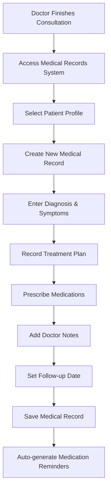

**📝 Business Rules:**
- **Doctor Authorization**: Chỉ bác sĩ mới được tạo/sửa hồ sơ y tế
- **Patient Verification**: Xác minh bệnh nhân trước khi tạo hồ sơ
- **Required Fields**: Diagnosis và treatment là bắt buộc
- **Audit Trail**: Ghi log mọi thay đổi trong hồ sơ

#### **1.2 Medical Record Data Flow**
```typescript
// 1. Tạo medical record từ appointment
const createMedicalRecord = async (appointmentData: IAppointment) => {
  const medicalRecord = await MedicalRecords.create({
    profileId: appointmentData.profileId,
    doctorId: appointmentData.doctorId,
    appointmentId: appointmentData._id,
    diagnosis: diagnosisInput,
    symptoms: symptomsInput,
    treatment: treatmentPlan,
    medications: prescribedMedications,
    notes: doctorNotes,
    followUpDate: nextAppointmentDate
  });

  // 2. Auto-create medication reminders nếu có kê đơn thuốc
  if (prescribedMedications) {
    await createMedicationReminders(medicalRecord._id, medicationList);
  }

  return medicalRecord;
};
```

### **PHASE 2: PATIENT ACCESS & HISTORY**

#### **2.1 Patient Medical History View**
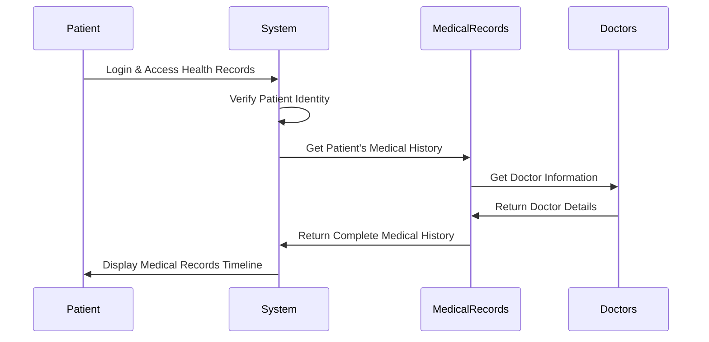

#### **2.2 Medical History Display**
```typescript
interface PatientMedicalHistory {
  records: Array<{
    recordId: string;
    date: Date;
    doctorName: string;
    diagnosis: string;
    treatment: string;
    medications: string;
    followUpDate?: Date;
    appointmentId?: string;
  }>;
  totalRecords: number;
  healthSummary: {
    chronicConditions: string[];
    allergies: string[];
    ongoingMedications: string[];
    lastVisit: Date;
    nextFollowUp?: Date;
  };
}
```

---

## 🔄 LUỒNG LÀM VIỆC - MEDICATIONS & REMINDERS

### **PHASE 1: MEDICATION MANAGEMENT**

#### **1.1 Medicine Database Setup**
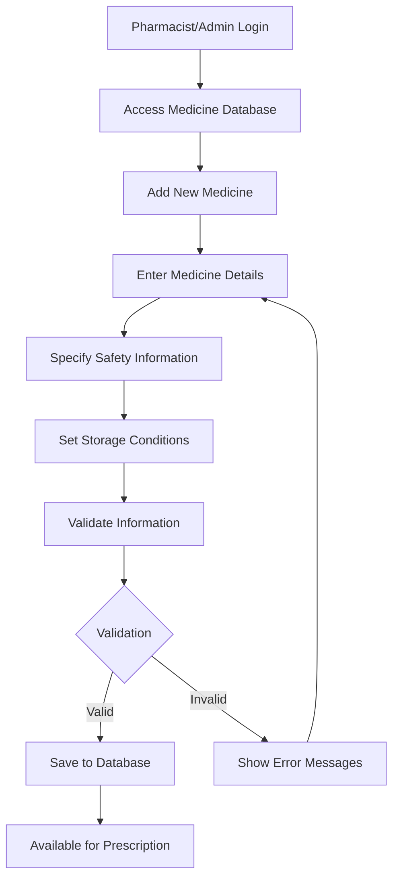

#### **1.2 Prescription to Reminder Flow**
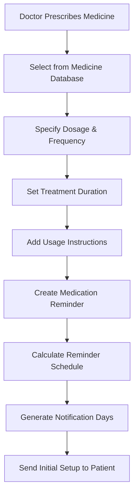

**📝 Implementation Detail:**
```typescript
// Tạo medication reminder từ prescription
const createMedicationReminder = async (prescriptionData: {
  profileId: string;
  medicineId: string;
  medicalRecordId: string;
  dosage: string;
  frequency: string;
  duration: number;
  instructions?: string;
  reminderTimes: string[];
}) => {
  const startDate = new Date();
  const endDate = new Date(startDate.getTime() + (prescriptionData.duration * 24 * 60 * 60 * 1000));

  // 1. Tạo medication reminder
  const reminder = await MedicationReminders.create({
    ...prescriptionData,
    startDate,
    endDate,
    status: 'active'
  });

  // 2. Generate notification days cho toàn bộ duration
  const notificationDays = [];
  for (let date = new Date(startDate); date <= endDate; date.setDate(date.getDate() + 1)) {
    notificationDays.push({
      medicationReminderId: reminder._id,
      notificationDate: new Date(date),
      scheduledTimes: prescriptionData.reminderTimes,
      status: 'pending'
    });
  }

  await NotificationDays.insertMany(notificationDays);
  return reminder;
};
```

### **PHASE 2: DAILY MEDICATION TRACKING**

#### **2.1 Daily Reminder System**
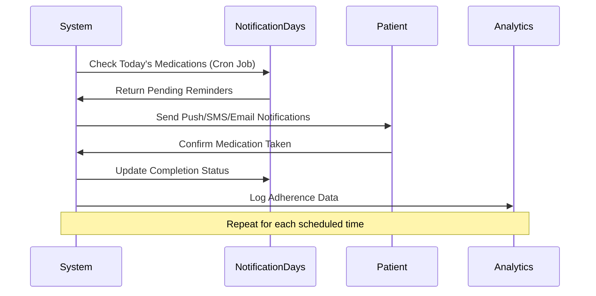

#### **2.2 Patient Medication Dashboard**
```typescript
interface PatientMedicationDashboard {
  todaysMedications: Array<{
    medicineName: string;
    dosage: string;
    scheduledTimes: string[];
    completedTimes: string[];
    pendingTimes: string[];
    nextReminderTime?: string;
    instructions: string;
  }>;
  
  adherenceStats: {
    thisWeek: number;    // % tuân thủ tuần này
    thisMonth: number;   // % tuân thủ tháng này
    overallScore: number; // Điểm tuân thủ tổng thể
  };
  
  upcomingMedications: Array<{
    medicineName: string;
    endDate: Date;
    daysRemaining: number;
    refillReminder?: boolean;
  }>;
}
```

### **PHASE 3: MEDICATION ADHERENCE TRACKING**

#### **3.1 Adherence Analytics**
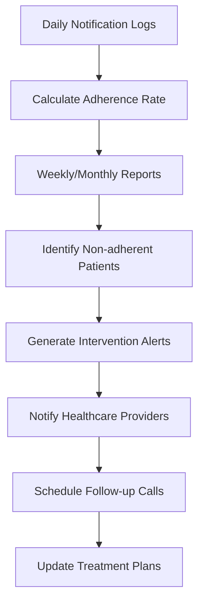

#### **3.2 Adherence Calculation Logic**
```typescript
class AdherenceCalculator {
  static calculateAdherence(
    medicationReminderId: string,
    startDate: Date,
    endDate: Date
  ): Promise<AdherenceReport> {
    // 1. Lấy tất cả notification days trong khoảng thời gian
    const notificationDays = await NotificationDays.find({
      medicationReminderId,
      notificationDate: { $gte: startDate, $lte: endDate }
    });

    // 2. Tính toán adherence metrics
    let totalScheduledDoses = 0;
    let completedDoses = 0;
    let missedDoses = 0;

    notificationDays.forEach(day => {
      totalScheduledDoses += day.scheduledTimes.length;
      completedDoses += day.completedTimes?.length || 0;
      missedDoses += day.skippedTimes?.length || 0;
    });

    const adherenceRate = (completedDoses / totalScheduledDoses) * 100;
    const missedRate = (missedDoses / totalScheduledDoses) * 100;

    return {
      adherenceRate,
      missedRate,
      totalScheduledDoses,
      completedDoses,
      missedDoses,
      consistency: this.calculateConsistency(notificationDays)
    };
  }
}
```

---

## 📊 API ENDPOINTS - MEDICAL RECORDS & MEDICINES

### **1. Medical Records Management**

#### **POST /api/medical-records**
```typescript
// Create medical record (Doctor only)
Request Body:
{
  profileId: string;          // Required
  appointmentId?: string;     // Optional
  diagnosis: string;          // Required
  symptoms?: string;          // Optional
  treatment: string;          // Required
  medications?: string;       // Optional
  notes?: string;            // Optional
  followUpDate?: Date;       // Optional
}

Business Rules:
- Requires doctor role
- Auto-sets doctorId from authenticated user
- Validates profileId exists
- Validates appointmentId belongs to doctor (if provided)
```

#### **GET /api/medical-records/patient/:profileId**
```typescript
// Get patient's medical history
Query Parameters:
- page?: number (default: 1)
- limit?: number (default: 10)
- startDate?: Date
- endDate?: Date
- doctorId?: string

Access Control:
- **Staff: VAI TRÒ QUẢN LÝ TRUNG TÂM** (Central Management Authority)
  * Quản lý toàn bộ medical records và appointments
  * Điều phối chăm sóc sức khỏe tổng thể cho bệnh nhân
  * Hỗ trợ bác sĩ trong quy trình khám và điều trị
  * Theo dõi và đảm bảo continuity of care
  * Xử lý emergency situations và priority cases
```

### **2. Medicines Management**

#### **POST /api/medicines**
```typescript
// Add new medicine (Pharmacist/Admin only)
Request Body:
{
  name: string;              // Required, unique
  activeIngredient?: string;
  dosageForm: string;        // Required
  strength?: string;
  manufacturer?: string;
  description?: string;
  sideEffects?: string;
  contraindications?: string;
  storageConditions?: string;
}
```

#### **GET /api/medicines/search**
```typescript
// Search medicines for prescription
Query Parameters:
- q: string (search term)
- dosageForm?: string
- activeIngredient?: string
- limit?: number (default: 20)

Response:
{
  medicines: Array<{
    _id: string;
    name: string;
    activeIngredient: string;
    dosageForm: string;
    strength: string;
    safetyInfo: {
      sideEffects: string;
      contraindications: string;
    };
  }>;
}
```

### **3. Medication Reminders**

#### **POST /api/medication-reminders**
```typescript
// Create medication reminder (Doctor/Patient)
Request Body:
{
  profileId: string;         // Required
  medicineId: string;        // Required
  medicalRecordId?: string;  // Optional (if from prescription)
  dosage: string;            // Required
  frequency: string;         // Required
  duration: number;          // Required (days)
  instructions?: string;
  reminderTimes: string[];   // Required ["08:00", "14:00", "20:00"]
}

Auto-processing:
- Validates medicine exists
- Calculates startDate and endDate
- Generates NotificationDays for entire duration
- Sets up notification scheduling
```

#### **PUT /api/medication-reminders/:id/take**
```typescript
// Mark medication as taken
Request Body:
{
  takenAt: DateTime;         // When medication was taken
  notes?: string;           // Optional patient notes
}

Business Logic:
- Updates today's NotificationDays with completion
- Calculates adherence impact
- Triggers congratulations/encouragement notifications
```

#### **GET /api/medication-reminders/dashboard/:profileId**
```typescript
// Get patient's medication dashboard
Response:
{
  todaysMedications: IMedicationToday[];
  adherenceStats: IAdherenceStats;
  upcomingMedications: IUpcomingMedication[];
  recentActivity: IRecentActivity[];
}
```

---

## 🔐 BẢO MẬT VÀ PHÂN QUYỀN - MEDICAL DATA

### **Staff Role Permissions - Comprehensive System Access**

#### **👩‍💼 Staff** (CENTRAL OPERATIONAL ROLE)
```typescript
const comprehensiveStaffPermissions = {
  // === CORE MEDICAL SYSTEM ACCESS ===
  medicalRecords: [
    "read_all_patients", 
    "basic_management", 
    "schedule_follow_ups",
    "coordinate_patient_care"
  ],
  medicines: [
    "read", 
    "search", 
    "assist_with_prescriptions",
    "medication_inventory_tracking"
  ],
  medicationReminders: [
    "read_all_patients", 
    "monitor_patient_adherence",
    "coordinate_refill_reminders",
    "support_medication_management"
  ],
  
  // === COMPREHENSIVE APPOINTMENT ECOSYSTEM ===
  appointmentLifecycle: [
    "full_lifecycle_management",
    "pre_appointment_preparation",
    "during_appointment_support", 
    "post_appointment_follow_up"
  ],
  patientFlow: [
    "optimize_patient_routing",
    "manage_waiting_times",
    "coordinate_multi_department_visits"
  ],
  
  // === HEALTHCARE OPERATIONS ===
  clinicOperations: [
    "daily_operations_oversight",
    "resource_optimization",
    "quality_assurance_basic",
    "workflow_improvement"
  ],
  emergencyManagement: [
    "handle_urgent_appointments",
    "coordinate_emergency_protocols",
    "priority_patient_management"
  ],
  
  // === PATIENT RELATIONSHIP MANAGEMENT ===
  patientExperience: [
    "comprehensive_patient_support",
    "complaint_resolution",
    "satisfaction_monitoring",
    "communication_facilitation"
  ],
  healthEducation: [
    "provide_basic_health_guidance",
    "appointment_preparation_education",
    "follow_up_instruction_support"
  ],
  
  // === BUSINESS INTELLIGENCE ===
  dataAnalytics: [
    "operational_performance_tracking",
    "patient_trend_analysis", 
    "resource_utilization_monitoring",
    "improvement_opportunity_identification"
  ],
  qualityMetrics: [
    "patient_satisfaction_tracking",
    "appointment_efficiency_monitoring",
    "service_quality_assessment"
  ]
};
```

**🌟 Staff Position - Healthcare Operations Hub:**

**🎯 STRATEGIC IMPORTANCE**
Staff đóng vai trò trung tâm trong hệ sinh thái chăm sóc sức khỏe, là cầu nối quan trọng giữa:
- Bệnh nhân và bác sĩ
- Các phòng ban trong phòng khám
- Hệ thống công nghệ và con người
- Dịch vụ y tế và trải nghiệm khách hàng

**⚡ OPERATIONAL EXCELLENCE**
- **Efficiency Optimization**: Tối ưu hóa quy trình và thời gian chờ đợi
- **Resource Coordination**: Điều phối tài nguyên phòng khám hiệu quả
- **Quality Assurance**: Đảm bảo chất lượng dịch vụ và tuân thủ quy trình
- **Continuous Improvement**: Cải tiến liên tục dựa trên phản hồi và dữ liệu

**🤝 PATIENT ADVOCACY**
- **Comprehensive Support**: Hỗ trợ toàn diện từ booking đến follow-up
- **Communication Bridge**: Truyền đạt thông tin giữa bệnh nhân và đội ngũ y tế
- **Problem Resolution**: Giải quyết vấn đề và khiếu nại của bệnh nhân
- **Care Coordination**: Điều phối chăm sóc liên tục và tích hợp

---

## 📈 HEALTH ANALYTICS & REPORTING

### **1. Medical Records Analytics**
```typescript
interface MedicalAnalytics {
  diagnosisStatistics: Array<{
    diagnosis: string;
    count: number;
    trendDirection: "up" | "down" | "stable";
    seasonalPattern?: boolean;
  }>;
  
  treatmentEffectiveness: Array<{
    treatment: string;
    successRate: number;
    averageDuration: number;
    patientSatisfaction: number;
  }>;
  
  doctorPerformance: Array<{
    doctorId: string;
    totalPatients: number;
    averageFollowUpTime: number;
    patientRetentionRate: number;
  }>;
}
```

### **2. Medication Adherence Reports**
```typescript
interface AdherenceAnalytics {
  overallAdherence: {
    clinicWide: number;
    byMedicationType: Map<string, number>;
    byAgeGroup: Map<string, number>;
    byGender: Map<string, number>;
  };
  
  riskFactors: Array<{
    factor: string;
    impactOnAdherence: number;
    recommendedInterventions: string[];
  }>;
  
  interventionEffectiveness: Array<{
    intervention: string;
    beforeAdherence: number;
    afterAdherence: number;
    improvement: number;
  }>;
}
```

---

## 🚀 TÍNH NĂNG NÂNG CAO

### **1. AI-Powered Drug Interaction Checking**
```typescript
class DrugInteractionChecker {
  static async checkInteractions(
    currentMedications: string[],
    newMedicine: string
  ): Promise<InteractionReport> {
    // Check against drug interaction database
    // Analyze severity levels
    // Generate recommendations
    
    return {
      hasInteractions: boolean;
      interactions: Array<{
        medicine1: string;
        medicine2: string;
        severity: "mild" | "moderate" | "severe";
        description: string;
        recommendation: string;
      }>;
      alternatives?: string[];
    };
  }
}
```

### **2. Smart Medication Scheduling**
```typescript
class SmartScheduler {
  static generateOptimalSchedule(
    medications: IMedicationReminder[],
    patientPreferences: {
      wakeUpTime: string;
      sleepTime: string;
      mealTimes: string[];
      workSchedule?: {
        startTime: string;
        endTime: string;
      };
    }
  ): OptimizedSchedule {
    // Analyze medication requirements (with food, empty stomach, etc.)
    // Consider drug interactions timing
    // Optimize for patient lifestyle
    // Minimize pill burden
    
    return optimizedSchedule;
  }
}
```

### **3. Predictive Health Analytics**
```typescript
interface PredictiveHealthInsights {
  riskAssessment: {
    chronicDiseaseRisk: number;
    medicationAdherenceRisk: number;
    complicationRisk: number;
  };
  
  earlyWarningSignals: Array<{
    signal: string;
    severity: "low" | "medium" | "high";
    recommendedAction: string;
    timeframe: string;
  }>;
  
  personalizedRecommendations: Array<{
    category: "lifestyle" | "medication" | "follow-up";
    recommendation: string;
    evidence: string;
    priority: number;
  }>;
}
```

---

## 🔧 TỐI ƯU HÓA PERFORMANCE - MEDICAL DATA

### **1. Database Indexing Strategy**
```typescript
// MedicalRecords indexes
db.medicalrecords.createIndex({ "profileId": 1, "createdAt": -1 }); // Patient history
db.medicalrecords.createIndex({ "doctorId": 1, "createdAt": -1 }); // Doctor's patients
db.medicalrecords.createIndex({ "appointmentId": 1 }); // Appointment lookup
db.medicalrecords.createIndex({ "followUpDate": 1 }); // Follow-up scheduling

// Medicines indexes
db.medicines.createIndex({ "name": "text", "activeIngredient": "text" }); // Search
db.medicines.createIndex({ "dosageForm": 1 }); // Filter by form
db.medicines.createIndex({ "name": 1 }); // Unique constraint

// MedicationReminders indexes
db.medicationreminders.createIndex({ "profileId": 1, "status": 1 }); // Active medications
db.medicationreminders.createIndex({ "endDate": 1 }); // Expiring medications
db.medicationreminders.createIndex({ "medicineId": 1 }); // Medicine usage

// NotificationDays indexes
db.notificationdays.createIndex({ 
  "medicationReminderId": 1, 
  "notificationDate": 1 
}); // Daily reminders
db.notificationdays.createIndex({ 
  "notificationDate": 1, 
  "status": 1 
}); // Today's pending
```

### **2. Caching Strategy for Medical Data**
```typescript
interface MedicalDataCaching {
  redis: {
    patientMedicalHistory: "1h";     // Recent access patterns
    medicineSearch: "4h";            // Popular medicine lookups
    adherenceStats: "30m";           // Real-time updates needed
    todaysMedications: "15m";        // Frequent access
  };
  
  memory: {
    drugInteractions: "application_lifetime"; // Critical safety data
    medicineFormulations: "application_lifetime"; // Reference data
  };
}
```

---

**🎯 KẾT LUẬN**

Hệ thống quản lý **Medical Records & Medicines** đã được tích hợp seamlessly với workflow STI Testing, tạo thành một comprehensive healthcare management platform:

✅ **Tính Toàn Vẹn Dữ Liệu**: Relationships rõ ràng giữa medical records, medicines và reminders  
✅ **Bảo Mật Y Tế**: HIPAA-compliant access control, patient privacy protection  
✅ **Medication Safety**: Drug interaction checking, adherence monitoring  
✅ **Smart Reminders**: AI-powered scheduling, personalized notifications  
✅ **Clinical Decision Support**: Evidence-based recommendations, predictive analytics  
✅ **Patient Engagement**: User-friendly medication tracking, health insights  

Hệ thống hiện tại đã sẵn sàng phục vụ đầy đủ các nhu cầu:
- **Quản lý hồ sơ y tế** digital hoàn chỉnh
- **Kê đơn thuốc** thông minh với safety checks
- **Theo dõi tuân thủ điều trị** real-time
- **Phân tích sức khỏe** predictive và personalized

Platform có thể mở rộng thêm features như telemedicine, AI diagnostics, wearable device integration khi cần thiết. 

const PatientTestResultsList = ({ profileId }: { profileId: string }) => {
  const [results, setResults] = useState<ITestResults[]>([]);
  const [loading, setLoading] = useState(true);

  useEffect(() => {
    loadTestResults();
  }, [profileId]);

  const loadTestResults = async () => {
    try {
      const response = await testResultsApi.getByProfile(profileId);
      setResults(response.data);
    } catch (error) {
      message.error('Không thể tải kết quả xét nghiệm');
    } finally {
      setLoading(false);
    }
  };

  return (
    <div className="test-results-list">
      {results.map(result => (
        <Card key={result._id} className="result-card">
          <div className="result-header">
            <h3>Xét nghiệm ngày {formatDate(result.createdAt)}</h3>
            <Tag color="blue">Bác sĩ: {result.doctorName}</Tag>
          </div>
          
          <div className="result-content">
            <p><strong>Kết luận:</strong> {result.conclusion}</p>
            <p><strong>Khuyến nghị:</strong> {result.recommendations}</p>
          </div>
          
          <Button 
            type="link" 
            onClick={() => viewDetailedResults(result._id)}
          >
            Xem chi tiết các chỉ số
          </Button>
        </Card>
      ))}
    </div>
  );
}; 