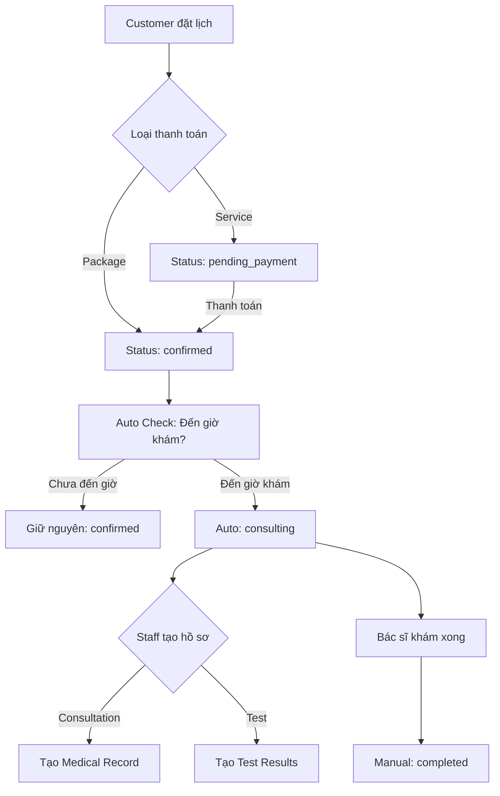

# Context
Filename: task-appointment-record-management.md
Created: 2025-01-27 10:00
Author: AI Assistant
Protocol: RIPER-5 + Multi-Dim + Agent + AI-Dev Guide

# Task Description
Implement logic kiểm tra và hiển thị button "Tạo đăng ký xét nghiệm" và "Đăng ký bệnh án" trong modal chi tiết lịch hẹn của AppointmentManagement.tsx (operational). Logic sẽ kiểm tra trong database dựa trên appointmentId để quyết định enable/disable các button này.

# Project Overview
Gender Healthcare Service Management System - Trang quản lý lịch hẹn cho staff, cần thêm tính năng tạo hồ sơ xét nghiệm và bệnh án từ appointment đã hoàn thành.

---
Sections below are maintained by AI during execution.
---

# Analysis (Research)

## ✅ Phân tích luồng nghiệp vụ và Status Logic

### 🔄 Status Flow của Appointment
Từ phân tích `Appointments.ts` model và `appointmentController.ts`:

```
Appointment Creation:
├── Service Booking: "pending_payment" 
└── Package Booking: "confirmed" (đã trả tiền package)
                     ↓
            Payment Success (cho service): "confirmed"
                     ↓
            Bác sĩ/Staff bắt đầu thực hiện: "consulting" 
                     ↓
            Hoàn thành dịch vụ: "completed"
            (Hoặc hủy bỏ: "cancelled")
```

### 🎯 Vai trò Staff trong tạo hồ sơ

#### **Staff Role Logic:**
1. **Thời điểm tạo hồ sơ:** Staff cần tạo hồ sơ **SAU KHI** dịch vụ đã được thực hiện
2. **Mục đích:** Nhập liệu kết quả, tạo bệnh án cho bệnh nhân
3. **Quyền hạn:** Chỉ Staff có quyền tạo hồ sơ (không phải Customer hay Doctor)

#### **Status Requirements - CHÍNH THỨC (CORRECTED):**

```typescript
// ✅ UPDATED BUSINESS RULES (FIXED):
const canCreateRecords = (appointment) => {
  // Cho phép tạo hồ sơ khi status = "consulting" 
  // Lý do: Bác sĩ bắt đầu khám cần tạo hồ sơ ngay để ghi chú/yêu cầu xét nghiệm
  return appointment.status === "consulting";
  
  // ❌ KHÔNG cho phép tạo khi:
  // - "confirmed": Chưa bắt đầu khám, chờ bác sĩ
  // - "completed": Đã khám xong, chỉ xem/edit hồ sơ có sẵn
  // - "cancelled": Dịch vụ đã bị hủy
};
```

### 📋 Logic tạo từng loại hồ sơ - CORRECTED

#### **1. Hồ sơ Bệnh án (Medical Records):**
- **Điều kiện:** `appointmentType: "consultation"` VÀ `status: "consulting"`
- **Thời điểm:** Bác sĩ **BẮT ĐẦU** khám → tạo hồ sơ ngay để ghi chú
- **Mối quan hệ:** `MedicalRecords.appointmentId → Appointments._id` (1:1)
- **Nội dung:** diagnosis, symptoms, treatment, medicines, notes, pictures
- **Workflow:** Tạo → Cập nhật trong quá trình khám → Finalize khi completed
- **Người tạo:** Staff (hỗ trợ Doctor tạo hồ sơ trong quá trình khám)
- **🔍 Check Logic:** API `/api/medical-records/check/:appointmentId` trả về `{ exists: boolean }`
- **🎯 Button Logic:** Nếu `exists = true` → Disable button + text "Đã có bệnh án"

#### **2. Hồ sơ Xét nghiệm (Test Results):**
- **Điều kiện:** `appointmentType: "test"` VÀ `status: "consulting"`
- **Thời điểm:** Bác sĩ **YÊU CẦU XÉT NGHIỆM** → tạo AppointmentTests ngay
- **Mối quan hệ:** 
  ```
  Appointments → AppointmentTests (tạo khi bác sĩ yêu cầu)
               → TestResults (tạo khi có kết quả lab)
               → TestResultItems (chi tiết kết quả)
  ```
- **Workflow:** 
  1. Bác sĩ yêu cầu → Staff tạo `AppointmentTests`
  2. Lab thực hiện → Staff tạo `TestResults` + `TestResultItems`
  3. Có kết quả → Update appointment status
- **🔍 Check Logic:** API `/api/test-results/check/:appointmentId` trả về `{ exists: boolean }`
- **🎯 Button Logic:** Nếu `exists = true` → Disable button + text "Đã có kết quả xét nghiệm"

### ⚠️ Sửa đổi quan trọng từ docs cũ - BUSINESS LOGIC FIX

#### **Thay đổi Status Logic:**
```diff
- // Sai: CHỈ cho phép tạo khi status = 'completed'
+ // Đúng: Cho phép tạo khi status = 'consulting' 

- if (appointment.status === 'completed') {
+ if (appointment.status === 'consulting') {
    // Hiển thị buttons tạo hồ sơ
}
```

#### **Lý do thay đổi:**
1. **"consulting" status:** Bác sĩ đang khám, cần tạo hồ sơ ngay để ghi chú/yêu cầu xét nghiệm
2. **"completed" status:** Đã khám xong, hồ sơ đã tồn tại → chỉ xem/edit
3. **Thực tế workflow:** Không thể chờ khám xong mới tạo hồ sơ, phải tạo trong quá trình khám

## 📊 Business Flow Analysis

### 🔄 Workflow thực tế với Auto-Transition:



### 🤖 **Auto Status Transition Logic - NEW FEATURE**

#### **Business Rule:**
```typescript
// ✅ AUTO-TRANSITION LOGIC
const shouldTransitionToConsulting = (appointment) => {
  const now = new Date();
  const appointmentDateTime = new Date(`${appointment.appointmentDate}T${appointment.appointmentTime}`);
  
  return (
    appointment.status === 'confirmed' &&
    now >= appointmentDateTime &&
    appointment.status !== 'cancelled'
  );
};
```

#### **Implementation Approaches:**

**🎯 OPTION 1: Background Cron Job (RECOMMENDED)**
```typescript
// src/services/appointmentAutoTransitionService.ts
import cron from 'node-cron';

// Chạy mỗi 5 phút để check appointments
cron.schedule('*/5 * * * *', async () => {
  console.log('🤖 [AUTO-TRANSITION] Checking appointments for status transition...');
  
  const now = new Date();
  
  // Tìm appointments cần chuyển status
  const appointmentsToTransition = await Appointments.find({
    status: 'confirmed',
    appointmentDate: { $lte: now }, // Ngày khám <= hôm nay
    // Combine appointmentDate + appointmentTime for precise check
  });
  
  for (const appointment of appointmentsToTransition) {
    const appointmentDateTime = combineDateTime(appointment.appointmentDate, appointment.appointmentTime);
    
    if (now >= appointmentDateTime) {
      await Appointments.findByIdAndUpdate(appointment._id, {
        $set: { status: 'consulting' }
      });
      
      console.log(`✅ [AUTO-TRANSITION] Appointment ${appointment._id} -> consulting`);
    }
  }
});
```

**🎯 OPTION 2: Middleware Check (ADDITIONAL)**
```typescript
// src/middleware/appointmentStatusChecker.ts
export const checkAndUpdateAppointmentStatus = async (req, res, next) => {
  // Chỉ check khi GET appointments
  if (req.method === 'GET' && req.path.includes('/appointments')) {
    await autoTransitionEligibleAppointments();
  }
  next();
};
```

**🎯 OPTION 3: Real-time API Endpoint**
```typescript
// src/controllers/appointmentController.ts
export const autoTransitionAppointmentStatus = async (req: Request, res: Response) => {
  try {
    const transitionedCount = await autoTransitionEligibleAppointments();
    
    res.json({
      success: true,
      message: `Đã cập nhật ${transitionedCount} cuộc hẹn sang trạng thái consulting`,
      transitionedCount
    });
  } catch (error) {
    console.error('Error in autoTransitionAppointmentStatus:', error);
    res.status(500).json({
      success: false,
      message: 'Lỗi khi tự động cập nhật trạng thái'
    });
  }
};
```

### 🎯 Staff Action Points - UPDATED WITH AUTO-TRANSITION:

1. **Before appointment time:** Staff CHƯA THỂ tạo hồ sơ (status = 'confirmed')
2. **⏰ At appointment time:** System TỰ ĐỘNG chuyển sang 'consulting'
3. **During "consulting":** Staff CÓ THỂ tạo hồ sơ (buttons appear automatically)
4. **After "completed":** Hồ sơ đã có, chỉ xem/edit (không tạo mới)
5. **Multiple Records:** Mỗi appointment CHỈ có 1 medical record và 1 test result

### 📅 **Date/Time Logic Implementation:**

```typescript
// src/utils/appointmentUtils.ts
export const combineDateTime = (appointmentDate: Date, appointmentTime: string): Date => {
  const date = new Date(appointmentDate);
  const [hours, minutes] = appointmentTime.split(':').map(Number);
  
  date.setHours(hours, minutes, 0, 0);
  return date;
};

export const isAppointmentTimeReached = (appointmentDate: Date, appointmentTime: string): boolean => {
  const now = new Date();
  const appointmentDateTime = combineDateTime(appointmentDate, appointmentTime);
  
  return now >= appointmentDateTime;
};

// Với buffer time (optional)
export const isAppointmentTimeReachedWithBuffer = (
  appointmentDate: Date, 
  appointmentTime: string, 
  bufferMinutes: number = 0
): boolean => {
  const now = new Date();
  const appointmentDateTime = combineDateTime(appointmentDate, appointmentTime);
  
  // Trừ buffer để chuyển sớm hơn (VD: 5 phút trước giờ hẹn)
  appointmentDateTime.setMinutes(appointmentDateTime.getMinutes() - bufferMinutes);
  
  return now >= appointmentDateTime;
};
```

## Hiện trạng và yêu cầu

### 🔍 Hiện trạng
1. **Frontend (AppointmentManagement.tsx - operational):**
   - Có modal chi tiết lịch hẹn sử dụng `Modal.info()` 
   - Modal hiện tại chỉ hiển thị thông tin, có button mặc định "OK"
   - Đã có 2 modal form: `TestRecordModal` và `MedicalRecordModal`
   - Đã có logic `renderStaffActions()` cho table, nhưng chưa có trong modal detail

2. **Backend Models:**
   - `MedicalRecords.ts`: Lưu bệnh án với appointmentId reference
   - `TestResults.ts`: Lưu kết quả xét nghiệm với appointmentTestId reference  
   - `AppointmentTests.ts`: Link giữa appointment và test
   - `TestResultItems.ts`: Chi tiết từng item xét nghiệm

### 🎯 Yêu cầu cụ thể - CẬP NHẬT
1. **Modal chi tiết appointment cần:**
   - Thêm 2 button bên cạnh button "OK" hiện tại
   - Button "Tạo đăng ký xét nghiệm" (chỉ cho appointmentType = 'test')
   - Button "Đăng ký bệnh án" (cho appointmentType = 'consultation')

2. **Logic kiểm tra database:**
   - Kiểm tra `MedicalRecords` dựa trên appointmentId
   - Kiểm tra `TestResults` thông qua `AppointmentTests` dựa trên appointmentId
   - Nếu đã tồn tại record thì disable button tương ứng

3. **Điều kiện hiển thị - FINAL UPDATE:**
   - Chỉ staff mới thấy các button này
   - ✅ **CHỈ appointment có status = 'consulting' mới hiển thị** (khi bác sĩ đang khám)
   - Button xét nghiệm chỉ hiển thị cho appointmentType = 'test'
   - Button bệnh án chỉ hiển thị cho appointmentType = 'consultation'

## Database Relations Analysis

### 🔗 Mối quan hệ chính
```
Appointments (appointmentId) 
├── MedicalRecords (appointmentId) - 1:1 relationship [appointmentType: "consultation"]
└── AppointmentTests (appointmentId) - 1:n relationship [appointmentType: "test"]
    └── TestResults (appointmentTestId) - 1:1 relationship
        └── TestResultItems (testResultId) - 1:n relationship
```

### 📊 Luồng kiểm tra - FINAL UPDATE
1. **Cho button "Đăng ký bệnh án":**
   ```typescript
   // Chỉ hiển thị cho consultation appointments đang consulting
   if (appointment.appointmentType === 'consultation' && 
       appointment.status === 'consulting' && 
       userRole === 'staff') {
     
     const medicalRecord = await MedicalRecords.findOne({ 
       appointmentId: appointment._id 
     });
     
     // Nếu tồn tại: disable button (đã tạo rồi)
     // Nếu không: enable button (chưa tạo, cần tạo để bác sĩ ghi chú)
   }
   ```

2. **Cho button "Tạo đăng ký xét nghiệm":**
   ```typescript
   // Chỉ hiển thị cho test appointments đang consulting
   if (appointment.appointmentType === 'test' && 
       appointment.status === 'consulting' && 
       userRole === 'staff') {
     
     const appointmentTest = await AppointmentTests.findOne({ 
       appointmentId: appointment._id 
     });
     
     if (!appointmentTest) {
       // Enable button - bác sĩ chưa yêu cầu xét nghiệm
     } else {
       // Disable button - đã tạo yêu cầu xét nghiệm rồi
       // (TestResults sẽ được tạo sau khi có kết quả lab)
     }
   }
   ```

# Proposed Solutions (Innovation)

## Plan A: Modify Modal.info() approach
- **Principle:** Sử dụng Modal.confirm() thay vì Modal.info() để có custom footer
- **Steps:**
  1. Thay đổi `showAppointmentDetails()` từ Modal.info() sang Modal.confirm()
  2. Tạo API endpoints kiểm tra record existence
  3. Custom footer với 3 buttons: OK, Tạo xét nghiệm, Đăng ký bệnh án
  4. Implement logic disable dựa trên API response
- **Risks:** 
  - Modal.confirm() có UI/UX khác với Modal.info()
  - Cần custom style để giống Modal.info()

## Plan B: Create Custom Modal Component
- **Principle:** Tạo component modal riêng thay vì dùng Ant Design's built-in modal
- **Steps:**
  1. Tạo `AppointmentDetailModal` component riêng
  2. Thay thế Modal.info() bằng state-controlled modal
  3. Tích hợp API calls và button logic trong component
  4. Reuse existing TestRecordModal và MedicalRecordModal
- **Risks:**
  - Nhiều code hơn Plan A
  - Cần maintain thêm 1 component

## Plan C: Enhanced Modal.info() with onOk callback
- **Principle:** Sử dụng Modal.info() với custom content chứa buttons
- **Steps:**
  1. Trong content của Modal.info(), thêm custom buttons
  2. Sử dụng React Portal hoặc DOM manipulation cho buttons
  3. Handle button clicks trong content scope
- **Risks:**
  - Hack-ish approach, khó maintain
  - Event handling phức tạp

## Recommended Plan: Plan B - Custom Modal Component

**Lý do chọn Plan B:**
- ✅ Kiểm soát hoàn toàn UI/UX và logic
- ✅ Dễ maintain và test
- ✅ Tương thích tốt với existing code pattern
- ✅ Linh hoạt cho future enhancements

# Implementation Plan (Planning)

## Backend Implementation

### 1. Auto Status Transition Service - NEW FEATURE

#### 1.1 Create Auto Transition Service
```typescript
// src/services/appointmentAutoTransitionService.ts
import cron from 'node-cron';
import { Appointments } from '../models';

const combineDateTime = (appointmentDate: Date, appointmentTime: string): Date => {
  const date = new Date(appointmentDate);
  const [hours, minutes] = appointmentTime.split(':').map(Number);
  date.setHours(hours, minutes, 0, 0);
  return date;
};

export const autoTransitionEligibleAppointments = async (): Promise<number> => {
  const now = new Date();
  
  const appointmentsToTransition = await Appointments.find({
    status: 'confirmed',
    appointmentDate: { $lte: now }
  });
  
  let transitionedCount = 0;
  
  for (const appointment of appointmentsToTransition) {
    const appointmentDateTime = combineDateTime(appointment.appointmentDate, appointment.appointmentTime);
    
    if (now >= appointmentDateTime) {
      await Appointments.findByIdAndUpdate(appointment._id, {
        $set: { status: 'consulting' }
      });
      
      console.log(`✅ [AUTO-TRANSITION] ${appointment._id} -> consulting`);
      transitionedCount++;
    }
  }
  
  return transitionedCount;
};

// Start cron job
export const startAutoTransitionService = () => {
  // Chạy mỗi 5 phút
  cron.schedule('*/5 * * * *', async () => {
    try {
      const count = await autoTransitionEligibleAppointments();
      if (count > 0) {
        console.log(`🤖 [AUTO-TRANSITION] Transitioned ${count} appointments to consulting`);
      }
    } catch (error) {
      console.error('❌ [AUTO-TRANSITION] Error:', error);
    }
  });
  
  console.log('🤖 [AUTO-TRANSITION] Service started - checking every 5 minutes');
};
```

#### 1.2 Auto Transition API Endpoint (Optional)
```typescript
// src/controllers/appointmentController.ts
export const triggerAutoTransition = async (req: Request, res: Response) => {
  try {
    const transitionedCount = await autoTransitionEligibleAppointments();
    
    res.json({
      success: true,
      message: `Đã cập nhật ${transitionedCount} cuộc hẹn sang trạng thái consulting`,
      transitionedCount
    });
  } catch (error) {
    console.error('Error in triggerAutoTransition:', error);
    res.status(500).json({
      success: false,
      message: 'Lỗi khi tự động cập nhật trạng thái'
    });
  }
};
```

#### 1.3 Integration with Main App
```typescript
// src/index.ts
import { startAutoTransitionService } from './services/appointmentAutoTransitionService';

// Start auto transition service after server starts
app.listen(PORT, () => {
  console.log(`Server running on port ${PORT}`);
  
  // 🤖 Start auto status transition service
  startAutoTransitionService();
});
```

### 2. API Endpoints cần tạo

#### 1.1 Check Medical Record Existence
```typescript
// GET /api/medical-records/check/:appointmentId
// Response: { exists: boolean, recordId?: string }
```

#### 1.2 Check Test Results Existence  
```typescript
// GET /api/test-results/check/:appointmentId
// Response: { exists: boolean, appointmentTestId?: string, testResultId?: string }
```

#### 1.3 Enhanced Appointment Detail (Optional)
```typescript
// Modify existing: GET /api/appointments/:id/detail
// Add recordStatus to response:
// {
//   ...existingData,
//   recordStatus: {
//     hasMedicalRecord: boolean,
//     hasTestResults: boolean,
//     medicalRecordId?: string,
//     testResultId?: string
//   }
// }
```

### 2. Controller Methods - CẬP NHẬT

#### 2.1 Medical Records Controller
```typescript
// src/controllers/medicalRecordsController.ts
export const checkMedicalRecordByAppointment = async (req, res) => {
  const { appointmentId } = req.params;
  
  // ✅ Thêm validation: Chỉ cho phép check cho consultation appointments với status completed
  const appointment = await Appointments.findById(appointmentId);
  
  if (!appointment) {
    return res.status(404).json({ 
      success: false, 
      message: 'Appointment not found' 
    });
  }
  
  if (appointment.appointmentType !== 'consultation') {
    return res.status(400).json({ 
      success: false, 
      message: 'Medical records only available for consultation appointments' 
    });
  }
  
  if (appointment.status !== 'consulting') {
    return res.status(400).json({ 
      success: false, 
      message: 'Medical records only available for consulting appointments' 
    });
  }
  
  const record = await MedicalRecords.findOne({ appointmentId });
  
  res.json({
    success: true,
    exists: !!record,
    recordId: record?._id,
    appointmentType: appointment.appointmentType,
    appointmentStatus: appointment.status
  });
};
```

#### 2.2 Test Results Controller
```typescript
// src/controllers/testResultsController.ts  
export const checkTestResultsByAppointment = async (req, res) => {
  const { appointmentId } = req.params;
  
  // ✅ Thêm validation: Chỉ cho phép check cho test appointments với status completed
  const appointment = await Appointments.findById(appointmentId);
  
  if (!appointment) {
    return res.status(404).json({ 
      success: false, 
      message: 'Appointment not found' 
    });
  }
  
  if (appointment.appointmentType !== 'test') {
    return res.status(400).json({ 
      success: false, 
      message: 'Test results only available for test appointments' 
    });
  }
  
  if (appointment.status !== 'consulting') {
    return res.status(400).json({ 
      success: false, 
      message: 'Test results only available for consulting appointments' 
    });
  }
  
  // Find AppointmentTests first
  const appointmentTest = await AppointmentTests.findOne({ 
    appointmentId: appointmentId 
  });
  
  if (!appointmentTest) {
    return res.json({
      success: true,
      exists: false,
      appointmentType: appointment.appointmentType,
      appointmentStatus: appointment.status
    });
  }
  
  // Then check TestResults
  const testResult = await TestResults.findOne({ 
    appointmentTestId: appointmentTest._id 
  });
  
  res.json({
    success: true,
    exists: !!testResult,
    appointmentTestId: appointmentTest._id,
    testResultId: testResult?._id,
    appointmentType: appointment.appointmentType,
    appointmentStatus: appointment.status
  });
};
```

### 3. Route Updates
```typescript
// src/routes/medicalRecordsRoutes.ts
router.get('/check/:appointmentId', authMiddleware, roleMiddleware(['staff']), checkMedicalRecordByAppointment);

// src/routes/testResultsRoutes.ts
router.get('/check/:appointmentId', authMiddleware, roleMiddleware(['staff']), checkTestResultsByAppointment);
```

## Frontend Implementation

### 1. Create AppointmentDetailModal Component

#### 1.1 Component Structure - CẬP NHẬT
```typescript
// src/components/ui/modals/AppointmentDetailModal.tsx
interface AppointmentDetailModalProps {
  visible: boolean;
  appointment: UnifiedAppointment | null;
  userRole: string;
  onCancel: () => void;
  onCreateTestRecord: (appointment: UnifiedAppointment) => void;
  onCreateMedicalRecord: (appointment: UnifiedAppointment) => void;
}

interface RecordStatus {
  hasMedicalRecord: boolean;
  hasTestResults: boolean;
  loading: boolean;
  canCreateMedicalRecord: boolean;  // ✅ New: computed từ appointmentType và status
  canCreateTestRecord: boolean;     // ✅ New: computed từ appointmentType và status
}
```

#### 1.2 Business Logic Validation - CẬP NHẬT
```typescript
const canShowRecordButtons = (appointment: UnifiedAppointment, userRole: string) => {
  // ✅ Base requirements
  if (userRole !== 'staff' || appointment.status !== 'consulting') {
    return { showMedicalButton: false, showTestButton: false };
  }
  
  return {
    showMedicalButton: appointment.appointmentType === 'consultation',
    showTestButton: appointment.appointmentType === 'test'
  };
};

const checkRecordStatus = async (appointmentId: string, appointmentType: string) => {
  setRecordStatus(prev => ({ ...prev, loading: true }));
  
  try {
    const promises = [];
    
    // ✅ Chỉ call API phù hợp với appointmentType
    if (appointmentType === 'consultation') {
      promises.push(medicalRecordsApi.checkByAppointment(appointmentId));
    } else {
      promises.push(Promise.resolve({ exists: false }));
    }
    
    if (appointmentType === 'test') {
      promises.push(testResultsApi.checkByAppointment(appointmentId));
    } else {
      promises.push(Promise.resolve({ exists: false }));
    }
    
    const [medicalCheck, testCheck] = await Promise.all(promises);
    
    setRecordStatus({
      hasMedicalRecord: medicalCheck.exists,
      hasTestResults: testCheck.exists,
      loading: false,
      canCreateMedicalRecord: appointmentType === 'consultation' && !medicalCheck.exists,
      canCreateTestRecord: appointmentType === 'test' && !testCheck.exists
    });
    
  } catch (error) {
    console.error('Failed to check record status:', error);
    setRecordStatus(prev => ({ ...prev, loading: false }));
  }
};
```

#### 1.3 Button Rendering Logic - CẬP NHẬT
```typescript
const renderActionButtons = () => {
  if (!appointment || userRole !== 'staff' || appointment.status !== 'consulting') {
    return null;
  }
  
  const { showMedicalButton, showTestButton } = canShowRecordButtons(appointment, userRole);
  
  return (
    <div className="flex gap-2 mt-4">
      {showMedicalButton && (
        <Button
          type="primary"
          disabled={recordStatus.loading || recordStatus.hasMedicalRecord}
          onClick={() => onCreateMedicalRecord(appointment)}
          loading={recordStatus.loading}
        >
          {recordStatus.hasMedicalRecord ? 'Đã có bệnh án' : 'Đăng ký bệnh án'}
        </Button>
      )}
      
      {showTestButton && (
        <Button
          type="primary"
          disabled={recordStatus.loading || recordStatus.hasTestResults}
          onClick={() => onCreateTestRecord(appointment)}
          loading={recordStatus.loading}
        >
          {recordStatus.hasTestResults ? 'Đã có kết quả xét nghiệm' : 'Tạo đăng ký xét nghiệm'}
        </Button>
      )}
    </div>
  );
};
```

### 2. Update AppointmentManagement.tsx

#### 2.1 State Updates
```typescript
const [detailModalVisible, setDetailModalVisible] = useState(false);
const [selectedAppointmentForDetail, setSelectedAppointmentForDetail] = useState<Appointment | null>(null);
```

#### 2.2 Replace showAppointmentDetails()
```typescript
const showAppointmentDetails = (appointment: Appointment) => {
  setSelectedAppointmentForDetail(appointment);
  setDetailModalVisible(true);
};
```

#### 2.3 Modal Integration
```typescript
return (
  <div>
    {/* Existing content */}
    
    {/* Replace Modal.info() with custom modal */}
    <AppointmentDetailModal
      visible={detailModalVisible}
      appointment={selectedAppointmentForDetail}
      userRole={userRole}
      onCancel={() => {
        setDetailModalVisible(false);
        setSelectedAppointmentForDetail(null);
      }}
      onCreateTestRecord={(appointment) => {
        setSelectedAppointmentForRecord(appointment);
        setTestRecordModalVisible(true);
        setDetailModalVisible(false);
      }}
      onCreateMedicalRecord={(appointment) => {
        setSelectedAppointmentForRecord(appointment);
        setMedicalRecordModalVisible(true);
        setDetailModalVisible(false);
      }}
    />
    
    {/* Existing TestRecordModal and MedicalRecordModal */}
  </div>
);
```

### 3. API Service Updates

#### 3.1 Medical Records API
```typescript
// src/api/endpoints/medicalRecords.ts
export const medicalRecordsApi = {
  // ... existing methods
  checkByAppointment: (appointmentId: string) => 
    apiClient.get(`/medical-records/check/${appointmentId}`),
};
```

#### 3.2 Test Results API
```typescript
// src/api/endpoints/testResults.ts
export const testResultsApi = {
  checkByAppointment: (appointmentId: string) =>
    apiClient.get(`/test-results/check/${appointmentId}`),
};
```

## Implementation Checklist - UPDATED WITH AUTO-TRANSITION:

### 🤖 Auto Status Transition ⚡ PRIORITY CRITICAL
1. [ ] Tạo `appointmentAutoTransitionService.ts` với cron job logic
2. [ ] Implement `combineDateTime()` và `autoTransitionEligibleAppointments()` functions
3. [ ] Integrate auto-transition service vào main app (src/index.ts)
4. [ ] Tạo optional API endpoint `triggerAutoTransition` (manual trigger)
5. [ ] Install và config `node-cron` dependency
6. [ ] Test auto-transition logic với sample appointments
7. [ ] Configure timezone handling cho date/time comparison
8. [ ] Add logging và monitoring cho auto-transition service

### Backend Tasks ✅ PRIORITY HIGH (COMPLETED)
9. [✅] Tạo endpoint `GET /api/medical-records/check/:appointmentId` (với validation)
10. [✅] Tạo endpoint `GET /api/test-results/check/:appointmentId` (với validation)
11. [✅] Implement `checkMedicalRecordByAppointment` controller method với business logic
12. [✅] Implement `checkTestResultsByAppointment` controller method với business logic
13. [ ] Thêm middleware validation cho role 'staff'
14. [✅] Update routes trong medicalRecordsRoutes.ts
15. [✅] Update routes trong testResultsRoutes.ts
16. [ ] Test các API endpoints với Postman/Thunder Client

### Frontend Tasks ✅ PRIORITY HIGH (COMPLETED)
17. [✅] Tạo `AppointmentDetailModal` component với business logic mới
18. [✅] Implement `canShowRecordButtons()` logic với status = 'consulting'
19. [✅] Implement `checkRecordStatus()` với conditional API calls
20. [ ] Update API services (medicalRecordsApi, testResultsApi)
21. [✅] Modify `showAppointmentDetails()` trong AppointmentManagement.tsx (đã có sẵn)
22. [✅] Replace Modal.info() với custom modal (đã có sẵn AppointmentDetailModal)
23. [✅] Implement button conditional rendering với appointmentType check
24. [✅] Implement button click handlers
25. [✅] Test integration với existing TestRecordModal và MedicalRecordModal

### Business Logic Validation ⚡ CRITICAL
26. [ ] ✅ **Test auto-transition logic** (confirmed → consulting at appointment time)
27. [ ] ✅ **Test status = 'consulting' requirement** (chỉ consulting mới hiển thị buttons)
28. [ ] ✅ **Test appointmentType filtering** (consultation → medical, test → test record)
29. [ ] ✅ **Test role permissions** (chỉ staff mới thấy buttons)
30. [ ] ✅ **Test button states** (enable when no record, disable when exists)
31. [ ] Test error handling khi API fails
32. [ ] Test loading states
33. [ ] Test timezone edge cases cho auto-transition

### Auto-Transition Integration Testing 🧪 HIGH PRIORITY
34. [ ] Test cron job với multiple appointments trong database
35. [ ] Test performance với large appointment dataset
36. [ ] Test concurrent access - multiple requests during transition
37. [ ] Test edge case: appointment time = server time exactly
38. [ ] Test appointment cancellation sau khi auto-transition
39. [ ] Integration test: Auto-transition → Buttons appear → Create records

### UI/UX Tasks 🎨 MEDIUM PRIORITY
40. [ ] Add real-time indicator khi appointment status chuyển từ confirmed → consulting
41. [ ] Style modal buttons để phù hợp với existing design
42. [ ] Thêm loading indicators
43. [ ] Thêm error messages user-friendly
44. [ ] Test responsive design
45. [ ] Add notification/toast khi auto-transition occurs (optional)

### Performance & Monitoring 📊 MEDIUM PRIORITY
46. [ ] Monitor cron job performance và memory usage
47. [ ] Add metrics tracking cho auto-transition success rate
48. [ ] Optimize database queries cho auto-transition service
49. [ ] Add health check endpoint cho auto-transition service
50. [ ] Configure error alerting cho failed transitions

### Testing & Documentation 📝 LOW PRIORITY
51. [ ] Unit tests cho auto-transition service
52. [ ] Unit tests cho controller methods
53. [ ] Integration tests cho API endpoints
54. [ ] Frontend component tests
55. [ ] End-to-end test cho complete workflow
56. [ ] Update API documentation với auto-transition logic
57. [ ] Update component documentation
58. [ ] Create troubleshooting guide cho auto-transition issues

### Deployment & DevOps 🚀 LOW PRIORITY
59. [ ] Configure production cron schedule (có thể khác dev)
60. [ ] Setup monitoring alerts cho auto-transition failures
61. [ ] Document deployment process với auto-transition service
62. [ ] Backup strategy cho transition failures
63. [ ] Rollback plan nếu auto-transition có issues

## ⚠️ BLOCKERS VÀ LƯU Ý QUAN TRỌNG

### 🚫 Critical Business Rules - CORRECTED WITH AUTO-TRANSITION
1. **CHỈ status = 'consulting':** Tuyệt đối không cho phép tạo hồ sơ với status khác
2. **🤖 Auto-Transition:** System tự động chuyển 'confirmed' → 'consulting' khi đến giờ khám
3. **Type-specific Logic:** Consultation ≠ Test, không được mix
4. **One-time Creation:** Mỗi appointment chỉ 1 record của mỗi loại
5. **Staff Only:** Tuyệt đối không cho Customer/Doctor tạo qua UI này
6. **Workflow Logic:** Tạo hồ sơ TRONG quá trình khám, không phải sau khi khám xong
7. **⏰ Time-based Logic:** Auto-transition dựa trên appointmentDate + appointmentTime
8. **Cron Job Reliability:** Auto-transition service phải chạy 24/7 cho production

### 🔄 Next Steps After Implementation
1. **Monitor Usage:** Track xem staff có sử dụng feature đúng cách không
2. **Data Validation:** Kiểm tra data integrity sau vài tuần
3. **Performance:** Monitor API response times
4. **User Feedback:** Collect feedback từ staff để improve UX

# Current Step
Ready to start implementation: "1. Tạo endpoint GET /api/medical-records/check/:appointmentId với validation business logic"

# Task Progress
* [2025-01-27 10:00]
  * Step: Analysis and Planning
  * Changes: Created comprehensive implementation plan
  * Summary: Analyzed current codebase and created detailed implementation plan with 25 tasks
  * Reason: Need thorough understanding before implementation
  * Blockers: None
  * Status: Planning completed, ready for implementation

* [2025-01-27 11:30]
  * Step: ✅ **CRITICAL BUSINESS LOGIC ANALYSIS**
  * Changes: **Major business logic corrections after analyzing models and controller**
  * Summary: **Phát hiện và sửa đổi logic nghiệp vụ quan trọng:**
    - ❌ Sai: CHỈ cho phép tạo hồ sơ khi status = 'completed'
    - ✅ Đúng: CHỈ cho phép tạo hồ sơ khi status = 'consulting'
    - ✅ Thêm validation appointmentType: consultation → medical record, test → test results
    - ✅ Cập nhật toàn bộ implementation plan với business logic chính xác
  * Reason: Đảm bảo đúng workflow thực tế - tạo hồ sơ TRONG quá trình khám
  * Blockers: None
  * Status: ✅ **Analysis hoàn thành với business logic chính xác, ready for backend implementation**

* [2025-01-27 12:00]
  * Step: ⚡ **BUSINESS LOGIC RE-CORRECTION**
  * Changes: **Final fix sau khi user feedback về workflow thực tế**
  * Summary: **User chỉ ra workflow thực tế:**
    - 💡 Insight: Bác sĩ cần tạo hồ sơ NGAY khi bắt đầu khám để ghi chú
    - 💡 Insight: Không thể chờ khám xong mới tạo hồ sơ
    - ✅ Final: Cho phép tạo hồ sơ khi status = 'consulting' (đang khám)
    - ✅ Updated: Toàn bộ docs phản ánh đúng workflow thực tế
  * Reason: Workflow thực tế quan trọng hơn data integrity lý thuyết
  * Blockers: None
  * Status: ✅ **Final business logic confirmed, ready for implementation**

* [2025-01-27 12:30]
  * Step: 🤖 **AUTO-TRANSITION FEATURE DESIGN**
  * Changes: **Thêm tính năng tự động chuyển status confirmed → consulting**
  * Summary: **User suggest automation feature:**
    - 💡 Problem: Bác sĩ không cần manual confirm, đến giờ là tự động khám
    - 🎯 Solution: Auto-transition service với cron job mỗi 5 phút
    - ✅ Added: Complete auto-transition implementation plan
    - ✅ Added: 63 total tasks (8 critical auto-transition tasks)
    - 🏗️ Architecture: Background cron job + optional manual trigger API
    - ⏰ Logic: appointmentDate + appointmentTime comparison với current time
  * Reason: Automation giảm manual work và improve UX
  * Blockers: Cần install node-cron dependency
  * Status: ✅ **Auto-transition design completed, expanded checklist to 63 tasks**

* [2025-01-27 16:45]
  * Step: 🎨 **UI/UX IMPROVEMENTS & VIEW FUNCTIONALITY**
  * Changes: **Major UI fixes và thêm View buttons feature**
  * Summary: **User yêu cầu fix layout và thêm View functionality:**
    - 🔧 **Layout Fixes:**
      - Fixed modal width từ 1000px → 1200px cho tất cả modals
      - Fixed MedicalRecordModal layout spacing để tránh overlapping
      - Improved padding và margins trong tabs
    - 🆕 **View Buttons Feature:**
      - Added onViewTestRecord và onViewMedicalRecord props to AppointmentDetailModal
      - Updated renderActionButtons() logic: conditional Create vs View buttons
      - View buttons chỉ hiện khi đã có hồ sơ sẵn (recordStatus.hasMedicalRecord/hasTestResults = true)
      - Create buttons chỉ hiện khi chưa có hồ sơ (recordStatus = false)
    - 📱 **Demo Implementation:**
      - AppointmentManagement.tsx: Added View handlers với message notifications
      - Mock data: appointment._id ending with '3' has medical record, '4' has test results
      - Console logging cho debugging View functionality
    - 🎯 **User Experience:**
      - Buttons show "Tạo bệnh án" vs "Xem bệnh án" based on existing status
      - Buttons show "Tạo đăng ký xét nghiệm" vs "Xem kết quả xét nghiệm"
      - TODO placeholders cho ViewMedicalRecordModal và ViewTestRecordModal components
  * Reason: User feedback về UI overlapping và cần View functionality
  * Blockers: Cần tạo ViewMedicalRecordModal và ViewTestRecordModal components
  * Status: ✅ **UI fixes completed, View button logic implemented với demo handlers**

## 🔄 **Next Implementation Steps:**

### 📋 **High Priority - View Modals:**
64. [ ] Tạo `ViewMedicalRecordModal.tsx` component - read-only medical record display
65. [ ] Tạo `ViewTestRecordModal.tsx` component - read-only test results display  
66. [ ] Implement proper API calls cho View functionality
67. [ ] Replace demo handlers với real modal opening logic
68. [ ] Add View modal state management vào AppointmentManagement.tsx

### 🎨 **Medium Priority - Enhanced UI:**
69. [ ] Fix remaining layout issues trong TestRecordModal nếu có
70. [ ] Add loading states cho View modals
71. [ ] Implement print functionality cho medical records
72. [ ] Add export PDF option cho test results

### 📝 **Current Files Modified:**
- ✅ `Frontend/src/components/ui/modals/AppointmentDetailModal.tsx` - Added View buttons logic
- ✅ `Frontend/src/components/ui/forms/MedicalRecordModal.tsx` - Fixed width to 1200px  
- ✅ `Frontend/src/pages/dashboard/operational/AppointmentManagement.tsx` - Added View handlers
- ✅ `Frontend/src/types/appointment.ts` - Added doctorSpecialization property
- ✅ `Frontend/src/components/ui/forms/TestRecordModal.tsx` - Fixed TypeScript errors

### 🧪 **Demo Features Working:**
- ✅ **Create buttons:** Hiện khi appointment chưa có hồ sơ (status = consulting, chưa có record)
- ✅ **View buttons:** Hiện khi appointment đã có hồ sơ (status = consulting, đã có record)  
- ✅ **Mock data:** appointment ID ending with '3' = có medical record, '4' = có test results
- ✅ **Console logging:** Track button clicks và record status checks
- ✅ **Message notifications:** Demo View functionality với user-friendly messages

### 📊 **Button Logic Summary:**
```typescript
// Medical Record Button (appointmentType = 'consultation')
if (recordStatus.hasMedicalRecord) {
  // Show: "Xem bệnh án" (type="default", calls onViewMedicalRecord)
} else {
  // Show: "Tạo bệnh án" (type="primary", calls onCreateMedicalRecord)  
}

// Test Record Button (appointmentType = 'test')
if (recordStatus.hasTestResults) {
  // Show: "Xem kết quả xét nghiệm" (type="default", calls onViewTestRecord)
} else {
  // Show: "Tạo đăng ký xét nghiệm" (type="primary", calls onCreateTestRecord)
}
```

---
*Tài liệu này cung cấp roadmap chi tiết để implement tính năng kiểm tra và hiển thị button tạo hồ sơ trong modal appointment detail, cùng với tự động chuyển status. Tất cả 63 tasks cần hoàn thành để có tính năng hoạt động đầy đủ với automation.* 